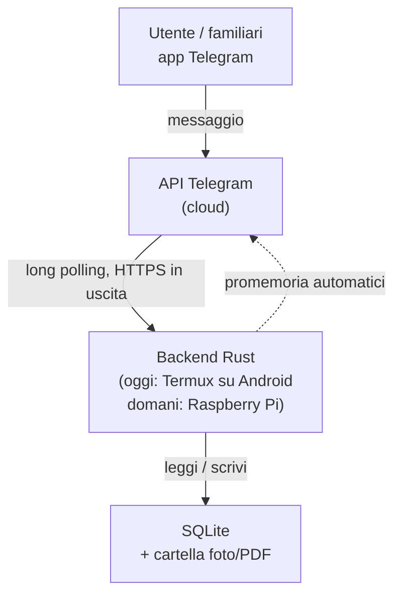

# Architettura

## Snapshot storico dei contenitori — Step 6C.4

La posizione viva continua a essere derivata da `item_luogo` + `contenitori`; lo storico, invece, deve essere immutabile. Per questo il 6C.4 salva nel momento dell'evento:
- identità storica di casa e stanza;
- identità storica del contenitore finale;
- percorso testuale completo dei contenitori (`Armadio / Ripiano 2 / Scatola`).

`storico_eventi` conserva il contesto dell'evento; `storico_cambi_luogo` conserva prima/dopo. Il percorso snapshot **non è la sorgente della posizione corrente** e non viene ricalcolato dopo rinomine/spostamenti/eliminazioni.

I contenitori usano `tipo_entita = 'contenitore'`, `modulo = 'luoghi'`, `componente = 'contenitori'`. Gli effetti automatici di un'azione gerarchica sono collegati con `evento_padre_id`: per esempio lo spostamento di un armadio è l'evento principale, mentre gli spostamenti del sottoalbero e degli oggetti contenuti sono eventi figli.

La rinomina di un contenitore non produce falsi eventi di spostamento per i discendenti: i vecchi snapshot conservano il vecchio nome, gli eventi successivi useranno il nuovo percorso.

La migration `20260820230000_storico_contenitori.sql` estende soltanto lo schema storico e registra le identità dei contenitori già esistenti senza creare eventi retroattivi.

## Spostamento oggetti nella gerarchia — Step 6C.3C

`item_luogo` resta la sorgente della posizione corrente. Il selettore Telegram tratta `contenitore_id` come terzo livello strutturato dopo abitazione e stanza.

Per un'assegnazione a contenitore vengono aggiornati atomicamente:
- `abitazione_id` = ambito del contenitore;
- `stanza_id` = stanza del contenitore, se presente;
- `contenitore_id` = contenitore scelto.

Per uno spostamento diretto a stanza/casa, `contenitore_id` viene esplicitamente azzerato.

La UI ricostruisce il percorso completo tramite `contenitori::container_path`. Dal 6C.4 lo storico conserva anche l'identità del contenitore finale e uno snapshot immutabile del percorso completo.

## Rifiniture posizione e annullamento — Step 6C.3B

La posizione operativa di un oggetto è la relazione strutturata `casa -> stanza opzionale -> contenitore opzionale`. Quando viene mostrata in UI, il gestionale ricostruisce il percorso completo e aggiunge il riferimento del luogo più specifico (`/luogo_h<ID>`, `/luogo_r<ID>`, `/luogo_c<ID>`).

Il campo storico `oggetti.posizione` non viene eliminato né migrato automaticamente: è considerato **legacy**, resta leggibile/ricercabile per compatibilità, ma non viene più richiesto nella creazione o modifica ordinaria.

`/annulla` è un comando contestuale, non una voce di navigazione permanente: compare/ha effetto durante input o operazioni temporanee e deve ripristinare la schermata logica di partenza.

Dopo una creazione avviata con `Nuovo oggetto qui`, il contesto di partenza viene mantenuto anche dopo il salvataggio: la scheda appena creata può quindi mostrare un pulsante inline `↩️ Torna a <luogo>` senza alterare la posizione dell'oggetto.

Convenzione visiva: `🏷️` identifica un **oggetto/item catalogato**, mentre `📦` identifica un **contenitore**. La distinzione deve restare coerente in menu, elenchi, schede, albero dei luoghi e storico individuale.


## Navigazione contestuale dei luoghi — Step 6C

Gerarchia canonica: `casa -> stanza opzionale -> contenitori annidabili -> item`. Il percorso visualizzato è derivato dalle relazioni, non è una stringa duplicata usata come sorgente dati.

La UI è place-contextual: le azioni dipendono dal luogo corrente, indipendentemente dal menu di provenienza.

Riferimenti Telegram canonici: `/luogo_h<ID>` (casa), `/luogo_r<ID>` (stanza), `/luogo_c<ID>` (contenitore). Gli ID tipizzati evitano ambiguità con nomi duplicati.

Contratto UI: ogni schermata interna rilevante deve offrire ritorno semantico al livello precedente e accesso diretto a `🏠 Menu principale`.

`Nuovo oggetto qui` mantiene casa/stanza/contenitore come relazione strutturata nella creazione dell'oggetto. Dettagli in `docs/moduli/navigazione-luoghi.md`.


## Infrastruttura di comunicazione operativa

La rete di sviluppo è separata dall'architettura applicativa del bot:

```text
PC Windows -- Tailscale + SSH/SCP --> Galaxy S9 / Termux
Galaxy S9 -- Git via SSH ----------> GitHub
Galaxy S9 -- HTTPS long polling ---> Telegram
```

Tailscale evita di dipendere dall'IP LAN e OpenSSH fornisce accesso/trasferimento senza password tramite chiavi dedicate. GitHub resta la fonte ufficiale del codice e non viene sostituito da SCP. La configurazione completa e le regole sui segreti sono documentate in `docs/INFRASTRUTTURA.md`.

Questo documento descrive come è fatto il progetto e perché è stato fatto
così. L'obiettivo è che chiunque lo legga — anche senza aver seguito le
discussioni originali — capisca la struttura abbastanza da poterci mettere
mano.

## 1. Obiettivo del progetto

Un gestionale personale per tenere traccia delle cose di casa: vestiti,
veicoli, ricette e oggetti generici. L'interfaccia è un bot Telegram, così
chi lo usa (anche senza competenze informatiche) interagisce scrivendo
messaggi normali, e l'accesso da fuori casa è gratuito dal punto di vista
della rete: nessuna porta da aprire, nessun dominio da configurare.

## 2. Decisioni di design e perché

Queste sono le scelte fondamentali del progetto, con la motivazione. Se in
futuro si vuole cambiare una di queste decisioni, va aggiornata anche questa
sezione.

### 2.1 Telegram come unica interfaccia

**Scelta**: il bot Telegram è l'unico punto di accesso al sistema (nessuna
app dedicata, nessun sito web nella prima fase).

**Perché**: Telegram gestisce già autenticazione, cifratura del trasporto e
notifiche push. Il backend comunica con l'API di Telegram in **uscita**
(long polling), quindi non serve esporre nessuna porta sul router di casa.
Chi usa il bot non deve installare nulla oltre a Telegram, che già conosce.

### 2.2 Rust come linguaggio del backend

**Scelta**: tutto il backend è scritto in Rust.

**Perché**: niente garbage collector (consumi bassi, importante su hardware
limitato come un telefono o un Raspberry Pi), sicurezza di memoria a
compile-time (rilevante per un servizio esposto a internet), concorrenza
sicura per gestire più moduli in parallelo. È anche il linguaggio che lo
sviluppatore sta approfondendo, quindi il progetto serve anche da percorso
di apprendimento.

### 2.3 SQLite come database

**Scelta**: SQLite, non un database client-server come PostgreSQL.

**Perché**: SQLite è un singolo file sul disco, senza servizio separato da
installare e configurare. Questo è decisivo per la portabilità: il sistema
è pensato per partire su un telefono Android (via Termux) e poi migrare su
un Raspberry Pi. Copiare il database significa copiare un file. Su un
servizio con un solo utilizzatore principale (più eventuali familiari) le
prestazioni di SQLite non sono un collo di bottiglia. Se in futuro il
progetto crescesse molto, si potrebbe migrare a PostgreSQL senza cambiare
lo schema logico dei dati, solo il motore sotto.

### 2.4 Nessun container (Docker)

**Scelta**: il backend gira come binario Rust compilato nativamente, senza
Docker.

**Perché**: Docker non funziona su Termux/Android senza root, e l'hardware
di partenza è proprio un telefono Android. Anche una volta migrato su
Raspberry Pi, un solo servizio leggero non trae benefici significativi dalla
containerizzazione. Rust si presta bene alla compilazione nativa per target
diversi (`cargo build --target <target>`), quindi il "problema" che Docker
risolverebbe (portabilità tra ambienti diversi) è già gestito diversamente.

### 2.5 Hardware: si parte da uno smartphone Android (Termux), non da un Raspberry Pi

**Scelta**: la prima versione gira su un Samsung Galaxy S9 già posseduto,
tramite Termux, sempre collegato alla corrente. Un Raspberry Pi è previsto
come possibile passo successivo (anche con ruolo di NAS personale), ma non
è un prerequisito.

**Perché**: zero spesa iniziale, hardware già disponibile, batteria non
performante e microfono difettoso dello smartphone non contano nulla per un
dispositivo che resta sempre attaccato alla corrente e con lo schermo
spento. L'architettura è pensata apposta per rendere questo passaggio
indolore quando/se si deciderà di fare l'upgrade: basta copiare il database
e i file multimediali, ricompilare il binario per il nuovo target, e
configurare l'avvio automatico sul nuovo sistema.

Punti di attenzione specifici per Termux su Android (in particolare Samsung,
noto per una gestione aggressiva dei processi in background):

- Termux va installato da F-Droid o GitHub, non dal Play Store (versione
  obsoleta e non più aggiornata).
- `termux-wake-lock` evita che la CPU vada in sospensione mentre il bot è
  attivo.
- **Termux:Boot** (app separata) avvia lo script del bot al riavvio del
  telefono.
- L'ottimizzazione batteria per Termux va disattivata nelle impostazioni
  Android.

### 2.6 Tabella `items` centrale per funzioni condivise

**Scelta**: ogni riga dei moduli che rappresentano beni/elementi gestiti
(un vestito, un veicolo, una ricetta, un oggetto) è anche una riga in una
tabella `items` comune. Foto, tag e promemoria fanno riferimento a `items`.
Dallo Step 6A anche la posizione strutturata usa una relazione condivisa
`item_luogo`.

**Perché**: senza questo punto comune, foto, tag, promemoria, luoghi e futuro
storico dovrebbero essere implementati separatamente per ciascun modulo. Il
principio architetturale è invece progettare una volta le funzioni trasversali
e riusarle quando il dominio lo consente. Case e stanze restano entità di
sistema con tabelle proprie e non sono forzate dentro `items`.

Dettagli dello schema core in `docs/schema-core.md`; luoghi in
`docs/moduli/luoghi.md`.


### 2.7 GitHub `main` come fonte ufficiale e ruoli dei dispositivi

**Scelta**: il branch `main` su GitHub è la fonte ufficiale del progetto. Il
PC Windows è il punto principale di sviluppo e gestione Git; il Galaxy S9 è
l'host reale e l'ambiente di test runtime.

**Perché**: separare i ruoli evita che ZIP, copie locali e modifiche parallele
creino stati divergenti. Il workflow normale è `PC -> GitHub -> S9`; una
modifica semplice nata sull'S9 può seguire temporaneamente
`S9 -> GitHub -> PC`, dopodiché si torna al flusso principale. Gli
aggiornamenti tra dispositivi usano preferibilmente `git pull --ff-only`, così
una divergenza non produce automaticamente merge inattesi.

Gli ZIP restano utili come snapshot o backup, ma non sostituiscono GitHub come
fonte di verità. Le procedure operative complete sono in `docs/HANDOFF.md`.

### 2.8 SQLite runtime e migration automatiche

**Scelta**: il backend usa SQLx 0.8.6 con driver SQLite bundled, runtime Tokio
e migration incorporate nel binario. `DATABASE_URL` puo' sovrascrivere il
percorso, ma il default e' `sqlite://data/db/gestionale.db`.

**Perche'**: SQLite resta adatto a un gestionale personale su un solo host,
mentre SQLx fornisce pool asincrono, gestione delle migration e una API Rust
chiara senza introdurre un server database separato. La serie 0.8 viene usata
intenzionalmente nello Step 4 per non imporre subito i requisiti toolchain piu'
nuovi della serie 0.9 sul Galaxy S9. Dependabot potra' proporre upgrade futuri
senza applicarli automaticamente.

All'avvio `src/db.rs`:

1. interpreta la URL SQLite;
2. crea la cartella padre se manca;
3. apre il database con `create_if_missing(true)`;
4. abilita esplicitamente le foreign key;
5. applica tutte le migration presenti in `migrations/`;
6. rende disponibile un `SqlitePool` al dispatcher Telegram.

Il file `build.rs` fa osservare a Cargo la cartella `migrations/`, cosi' nuove
migration vengono incorporate anche con Rust stable. Il comando `/status`
interroga lo stato reale del database senza modificare dati applicativi.

## 3. Flusso dei dati



Il backend non riceve mai connessioni in entrata: interroga periodicamente
i server Telegram (long polling) per nuovi messaggi. Questo è il motivo per
cui l'accesso da fuori rete locale funziona senza alcuna configurazione di
rete.

## 4. Struttura del repository

```text
gestionale-casa/
├── .github/
│   ├── workflows/
│   │   └── ci.yml             # CI Rust su push e pull request
│   └── dependabot.yml         # aggiornamenti dipendenze tramite PR
├── README.md                  # quick start e stato sintetico
├── CHANGELOG.md               # diario degli step e verifiche
├── ARCHITETTURA.md            # questo file
├── Cargo.toml
├── Cargo.lock                 # dependency graph bloccata e versionata
├── build.rs                    # ricompila se cambiano le migration
├── src/
│   ├── main.rs                # avvio del bot, dispatch dei comandi
│   ├── config.rs              # caricamento configurazione
│   ├── db.rs                  # pool SQLite, migration e stato runtime
│   ├── auth.rs                # whitelist chat_id autorizzati
│   └── modules/
│       ├── oggetti.rs
│       ├── luoghi.rs
│       ├── vestiti.rs
│       ├── veicoli.rs
│       └── ricette.rs
├── migrations/                # una migration .sql per ogni modifica schema
├── scripts/
│   ├── termux-boot.sh         # avvio automatico su Android
│   └── backup.sh              # backup consistente tramite API SQLite
├── docs/
│   ├── HANDOFF.md             # consegna e workflow operativo
│   ├── schema-core.md
│   └── moduli/                # documentazione dei moduli funzionali
└── data/                      # database e file personali, NON su Git
```

**Perché file singoli per modulo invece di una cartella per modulo**: allo
stato attuale ogni modulo è abbastanza semplice da stare in un solo file.
Se un modulo crescesse molto (es. il modulo ricette con la logica di
aggregazione della spesa), verrà diviso in una sotto-cartella
(`modules/ricette/`) con più file interni — il resto della struttura non
cambia.

## 5. Sicurezza

- **Token del bot**: mai nel codice o nel repository, solo in `.env`
  (escluso da git tramite `.gitignore`).
- **Whitelist utenti**: il bot risponde solo ai `chat_id` presenti in
  `.env`; chiunque altro scriva al bot viene ignorato o rifiutato
  esplicitamente.
- **Nessuna porta in ascolto**: il backend non apre porte in entrata (vedi
  sezione 3), quindi non c'è superficie d'attacco di rete diretta.
- **Utente non privilegiato**: il servizio non gira come root/utente
  amministratore.
- **Aggiornamenti di sicurezza**: sistema operativo dell'host aggiornato
  regolarmente.
- **Accesso per manutenzione**: sulla LAN è operativo un normale server
  OpenSSH in Termux (porta 8022), usato dal PC per terminale e trasferimento
  patch via SCP. GitHub `main` resta la fonte ufficiale. L'accesso fuori LAN
  resta futuro e dovrà usare Tailscale + OpenSSH/Termux, senza esporre SSH
  tramite port forwarding pubblico.
- **Backup**: copia periodica di database e foto su storage esterno,
  verificata periodicamente (un backup mai testato non è un backup
  affidabile).

## 5.1 Interfaccia applicativa dei moduli

Dallo Step 5A l'interfaccia Telegram usa due ingressi paralleli:

1. **inline keyboard**, pensata per l'uso quotidiano e come interfaccia
   principale;
2. **comandi testuali equivalenti**, utili come scorciatoie e per test/debug.

Le due strade non duplicano la logica: convergono sulle stesse funzioni Rust e
sulle stesse operazioni SQL. Per esempio `➕ Nuovo oggetto` e
`/oggetto_nuovo` aprono lo stesso flusso.

Le bozze non ancora salvate sono mantenute solo in memoria per chat. I dati
persistenti vengono scritti esclusivamente quando l'utente conferma `✅ Salva`.
Il salvataggio dell'oggetto avviene in una singola transazione che crea prima
`items` e poi la riga specifica `oggetti`.

Per importi monetari il progetto usa **centesimi interi**, non valori `REAL`,
evitando errori di rappresentazione floating point.

## 5.2 Luoghi e multi-abitazione — Step 6A

La posizione non è più modellata soltanto come testo libero. Lo Step 6A adotta
una struttura esplicita e condivisa:

```text
abitazioni
└── stanze

items ── item_luogo ──> abitazione + stanza opzionale
```

Decisioni:

- più abitazioni nello stesso account;
- ogni stanza appartiene a una sola abitazione;
- un item può essere senza luogo, nella sola casa oppure in una stanza;
- `item_luogo` è condiviso tra i moduli basati su `items`;
- una stanza selezionata deve appartenere alla casa selezionata: il vincolo è
  protetto anche a livello SQLite;
- eliminare una stanza non elimina gli item: restano nella casa senza stanza;
- eliminare una casa non elimina gli item: scompare solo la loro relazione di
  luogo;
- il campo `oggetti.posizione` resta come dettaglio libero, per esempio
  `scaffale 2` o `cassetto alto`;
- le vecchie stringhe di posizione non vengono interpretate o migrate
  automaticamente, per non trasformare dati reali sulla base di supposizioni.

La scelta `abitazioni` + `stanze` è intenzionalmente più esplicita di una tabella
gerarchica generica: oggi sono certi due livelli e i vincoli risultano più
semplici e leggibili. Lo Step 6C valuterà contenitori e sotto-posizioni senza
obbligare il 6A a decidere già una gerarchia arbitraria.

Dettagli in `docs/moduli/luoghi.md`.

## 6. Roadmap di sviluppo

- ~~**Step 1 — Scheletro iniziale**~~ — chiuso.
- ~~**Step 2 — Schema dati core**~~ — chiuso.
- ~~**Step 3 — Backend Telegram + whitelist**~~ — chiuso e verificato.
- ~~**Step 3.1 — Handoff, Git e CI**~~ — chiuso e verificato.
- ~~**Step 4 — SQLite runtime + migration + `/status`**~~ — chiuso e verificato.
- ~~**Step 5A — Oggetti generici**~~ — chiuso e verificato.
- ~~**Step 5B — Foto oggetti**~~ — chiuso e verificato.
- ~~**Step 5C — Modifica/eliminazione**~~ — chiuso, mergiato su `main` con CI verde.
- **Step 6A — Case, stanze e posizione strutturata** — corrente.
- **Step 6B — Storico globale + individuale** — eventi strutturati con data/ora,
  prima/dopo e filtri per modulo, casa, stanza, periodo e operazione.
- **Step 6C — Contenitori e sotto-posizioni**.
- **Step 7A — Documenti e garanzie**.
- **Step 7B — Promemoria e scadenze**.
- **Step 7C — Tag e ricerca globale**.
- **Step 8 — Primo nuovo modulo applicativo**, da scegliere fra Veicoli e
  Vestiti; Ricette resta pianificato successivamente.

Funzioni già approvate come direzioni future: manutenzioni, costi/valore,
prestiti, QR code, archivio degli elementi non più attivi, registro acquisti e
dashboard/statistiche. La specifica e l'ordine aggiornato sono mantenuti in
`docs/ROADMAP.md`.

Principio da preservare: foto, documenti, tag, promemoria, luoghi e storico
vanno progettati come servizi trasversali quando possibile, senza creare una
versione separata della stessa funzione per ogni modulo.

## 7. Estensioni future (non nel perimetro attuale)

- **Arduino Uno**: possibile sensore ambientale (es. umidità armadio) o
  lettore di codici a barre per il modulo oggetti, collegabile via USB
  seriale al Raspberry Pi quando sarà in uso.
- **Raspberry Pi come NAS personale**: ruolo tenuto separato dal backend a
  livello logico, con storage dedicato (disco USB esterno).
- **Amministrazione remota del Galaxy S9**: step futuro separato basato, se i
  test lo confermeranno, su Tailscale + server OpenSSH di Termux con chiavi SSH
  e senza port forwarding pubblico. Deve includere test da reti differenti,
  gestione del riavvio e comportamento Android in background.


## Case, stanze e posizione strutturata — Step 6A

Lo Step 6A aggiunge la migration `20260815183000_luoghi.sql` e il modulo
`src/modules/luoghi.rs`. La relazione fisica non viene messa direttamente nella
tabella `oggetti`: `item_luogo` punta a `items`, così lo stesso meccanismo potrà
essere riutilizzato in futuro per Vestiti e Veicoli.

Le cancellazioni dei luoghi sono progettate per non cancellare i beni. La
semantica è volutamente diversa dalla cancellazione di un oggetto:

- stanza eliminata → item ancora nella casa, stanza azzerata;
- casa eliminata → item ancora esistente, relazione di luogo rimossa.

La scheda oggetto permette di scegliere e cambiare casa/stanza. Elenchi e
ricerca espongono il luogo strutturato insieme al dettaglio libero.

## Modifica ed eliminazione degli oggetti — Step 5C

La modifica riusa lo stesso `ObjectDraft` della creazione ma conserva l'ID
dell'oggetto esistente. Il database viene aggiornato solo alla conferma finale:
`items` e `oggetti` sono modificati nella stessa transazione, evitando stati
parziali e duplicati. I campi opzionali possono essere riportati a `NULL`; il
nome resta obbligatorio.

L'eliminazione segue invece una strategia a due livelli:

1. conferma esplicita nell'interfaccia Telegram;
2. `DELETE` della riga `items`, delegando alle foreign key `ON DELETE CASCADE`
   la pulizia delle relazioni;
3. dopo il commit SQLite, rimozione della directory media locale dell'item.

Il database viene eliminato prima dei file: se la pulizia del filesystem fallisce
non si rischia di perdere le immagini lasciando però un item ancora attivo. Il
backend segnala l'eventuale directory residua per una pulizia manuale. Nessuna
nuova migration è necessaria nello Step 5C.

## Gestione file multimediali — Step 5B

Le foto non vengono affidate esclusivamente alla disponibilità futura dei file
Telegram. Il backend scarica una copia locale e il database conserva un percorso
relativo al progetto. Per gli oggetti la struttura scelta è:

```text
data/media/oggetti/<item_id>/telegram_<message_id>.<estensione>
```

La tabella core `foto` resta la fonte relazionale (`item_id`, `percorso_file`,
`ruolo`, `descrizione`). Non viene aggiunta una migration nello Step 5B perché lo
schema necessario era già stato predisposto nello Step 2. La prima immagine di un
item assume il ruolo `principale`; le successive `galleria`.

`data/` resta esclusa da Git. I file multimediali sono invece parte del backup
operativo: `scripts/backup.sh` copia `data/media` insieme al backup consistente
del database SQLite. Questa scelta rende il gestionale trasferibile in futuro su
un altro host senza dipendere dai file Telegram.

L'interfaccia Telegram mantiene la regola già adottata nello Step 5A: pulsanti
inline come percorso principale e comandi testuali equivalenti quando utili.
Inoltre il backend invia una notifica di avvio alle chat autorizzate e `/status`
fornisce sempre un pulsante per tornare al menu principale.

## Storico trasversale — Step 6B

Lo storico è un'infrastruttura condivisa, non specifica del modulo Oggetti. `storico_entita` mantiene un'identità storica permanente distinta dalla riga viva; `storico_eventi` contiene metadati e snapshot; `storico_cambiamenti` salva solo i campi realmente modificati; `storico_cambi_luogo` salva il prima/dopo strutturato di casa e stanza.

Il testo Telegram viene generato dai dati strutturati. Le rinomine o cancellazioni future non riscrivono il passato grazie agli snapshot. Le modifiche no-op e la scelta dello stesso luogo non generano eventi. Quando modifica applicativa e storico appartengono alla stessa operazione DB, vengono salvati nella stessa transazione.

La UI espone storico globale, storico individuale, dettaglio, paginazione e filtri combinabili. Lo stato dei filtri è codificato nei callback Telegram in forma compatta. Dettagli: `docs/moduli/storico.md`.
