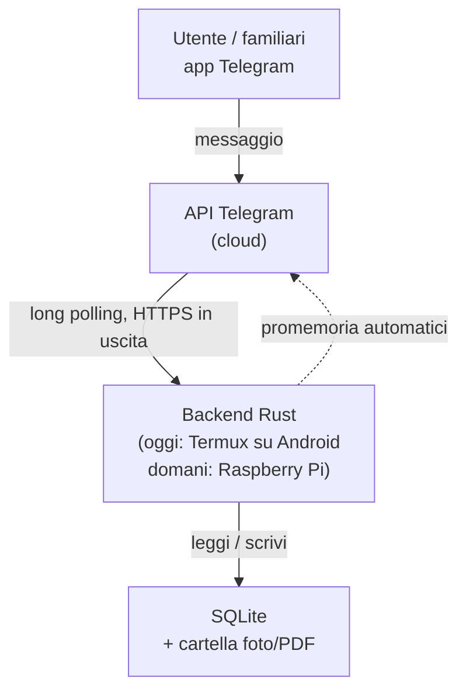

<!-- STEP7_2H_CHIUSURA_20260829 -->
# Aggiornamento architetturale autorevole — Step 7.2H chiuso (29/08/2026)

Il branch `step-7-alimentazione` ha completato il blocco **7.2H.0→7.2H.4F**. Le sezioni storiche più sotto restano valide per la cronologia; in caso di contrasto prevale questo aggiornamento.

## Modello corrente

- `utente/account` identifica chi usa il sistema;
- `spazio` è un contesto di collaborazione, **non** una casa fisica;
- case, stanze, contenitori e oggetti restano risorse fisiche assegnate a uno spazio e non diventano globali;
- proprietà, visibilità, membership e permessi sono concetti distinti;
- un Profilo alimentare rappresenta una persona alimentare ed è separato dall'account Telegram; il collegamento a un utente è opzionale;
- i Profili possono essere privati o condivisi tramite Spazi, ma non globali;
- contenuti globali sono ammessi solo per domini compatibili (es. cataloghi) e la pubblicazione globale resta un'azione amministrativa.

## Runtime Telegram

Gli handler principali continuano a ricevere `Arc<HandlerDependencies>` per evitare crescita dell'arità DPTree. `ContextBot` conserva la schermata UI principale e il contesto di navigazione.

Gli input testuali fuori da un wizard non sostituiscono la schermata corrente: vengono trattati come input inattesi. Dopo tre tentativi consecutivi viene aggiunto il suggerimento `/start`; il contatore viene azzerato da una navigazione/comando valido o dall'ingresso in un flusso che richiede input.

## Spazi e inviti

`src/modules/spazi_membri.rs` gestisce membership e inviti privati. Gli inviti usano deep-link Telegram e supportano ruolo, modalità monouso/riutilizzabile, limite utilizzi e scadenza. L'apertura da parte del creatore o di un membro già presente non consuma l'invito.

## Export tecnici

`scripts/export_miglioramenti.py` esporta il backlog/archivio Miglioramenti. `scripts/export_progetto.py` crea un handoff tecnico completo ma sanitizzato. L'export progetto ricrea sempre `_project_handoff/` da zero e include `CURRENT_STATE.md`, manifest Git/file, albero e regole di esclusione. `.env`, token, DB, `data/`, `.git/`, `target/`, backup e file runtime sono esclusi; pattern sensibili nei file testuali fanno fallire l'export in modo conservativo.

## Migration del blocco 7.2H

```text
20260827190000_profili_alimentari_fondazioni.sql
20260828074000_catalogo_gallette.sql
20260828101500_inviti_spazi_operativi.sql
20260828202500_h4c_inviti_verifica_guidata.sql
20260829002500_h4d_rifiniture_finali.sql
20260829005000_h4e_input_export_progetto.sql
```

Sono append-only; se risultano applicate sul DB reale non devono essere modificate in-place.

# Architettura

## Stato architetturale corrente — Step 7

Gli Step 1→6C sono chiusi e la baseline `main` resta il merge `219caba`.
Il branch corrente `step-7-alimentazione` ha chiuso il checkpoint documentale
7.0 con `135dd33` e sta implementando le fondazioni tecniche 7.1.

Lo Step 7 estende il progetto da gestionale personale a gestionale
personale/condiviso mediante utenti interni, spazi, membership e audit con
autore. Sopra queste fondamenta viene sviluppato il modulo Alimentazione.

La prima migration 7.1, `20260823153000_fondazioni_condivise.sql`, introduce
utenti, spazi, membership, preferenze, inviti e audit. Il checkpoint successivo
aggiunge `20260823174500_spazi_operativi.sql`: rimuove l'unicità globale legacy
di case/tag, rende l'unicità per spazio e abilita lo **spazio attivo** come
confine runtime per oggetti, luoghi, contenitori, foto e storico.

Le decisioni correnti sono raccolte in `docs/step7/`.

## Snapshot storico dei contenitori — Step 6C.4

La posizione viva continua a essere derivata da `item_luogo` + `contenitori`; lo storico, invece, deve essere immutabile. Per questo il 6C.4 salva nel momento dell'evento:
- identità storica di casa e stanza;
- identità storica del contenitore finale;
- percorso testuale completo dei contenitori (`Armadio / Ripiano 2 / Scatola`).

`storico_eventi` conserva il contesto dell'evento; `storico_cambi_luogo` conserva prima/dopo. Il percorso snapshot **non è la sorgente della posizione corrente** e non viene ricalcolato dopo rinomine/spostamenti/eliminazioni.

I contenitori usano `tipo_entita = 'contenitore'`, `modulo = 'luoghi'`, `componente = 'contenitori'`. Gli effetti automatici di un'azione gerarchica sono collegati con `evento_padre_id`: per esempio lo spostamento di un armadio è l'evento principale, mentre gli spostamenti del sottoalbero e degli oggetti contenuti sono eventi figli.

La rinomina di un contenitore non produce falsi eventi di spostamento per i discendenti: i vecchi snapshot conservano il vecchio nome, gli eventi successivi useranno il nuovo percorso.

La migration `20260820230000_storico_contenitori.sql` estende soltanto lo schema storico e registra le identità dei contenitori già esistenti senza creare eventi retroattivi.

## Spostamento oggetti nella gerarchia — Step 6C.3C

`item_luogo` resta la sorgente della posizione corrente. Il selettore Telegram tratta `contenitore_id` come terzo livello strutturato dopo abitazione e stanza.

Per un'assegnazione a contenitore vengono aggiornati atomicamente:
- `abitazione_id` = ambito del contenitore;
- `stanza_id` = stanza del contenitore, se presente;
- `contenitore_id` = contenitore scelto.

Per uno spostamento diretto a stanza/casa, `contenitore_id` viene esplicitamente azzerato.

La UI ricostruisce il percorso completo tramite `contenitori::container_path`. Dal 6C.4 lo storico conserva anche l'identità del contenitore finale e uno snapshot immutabile del percorso completo.

## Rifiniture posizione e annullamento — Step 6C.3B

La posizione operativa di un oggetto è la relazione strutturata `casa -> stanza opzionale -> contenitore opzionale`. Quando viene mostrata in UI, il gestionale ricostruisce il percorso completo e aggiunge il riferimento del luogo più specifico (`/luogo_h<ID>`, `/luogo_r<ID>`, `/luogo_c<ID>`).

Il campo storico `oggetti.posizione` non viene eliminato né migrato automaticamente: è considerato **legacy**, resta leggibile/ricercabile per compatibilità, ma non viene più richiesto nella creazione o modifica ordinaria.

`/annulla` è un comando contestuale, non una voce di navigazione permanente: compare/ha effetto durante input o operazioni temporanee e deve ripristinare la schermata logica di partenza.

Dopo una creazione avviata con `Nuovo oggetto qui`, il contesto di partenza viene mantenuto anche dopo il salvataggio: la scheda appena creata può quindi mostrare un pulsante inline `↩️ Torna a <luogo>` senza alterare la posizione dell'oggetto.

Convenzione visiva: `🏷️` identifica un **oggetto/item catalogato**, mentre `📦` identifica un **contenitore**. La distinzione deve restare coerente in menu, elenchi, schede, albero dei luoghi e storico individuale.


## Navigazione contestuale dei luoghi — Step 6C

Gerarchia canonica: `casa -> stanza opzionale -> contenitori annidabili -> item`. Il percorso visualizzato è derivato dalle relazioni, non è una stringa duplicata usata come sorgente dati.

La UI è place-contextual: le azioni dipendono dal luogo corrente, indipendentemente dal menu di provenienza.

Riferimenti Telegram canonici: `/luogo_h<ID>` (casa), `/luogo_r<ID>` (stanza), `/luogo_c<ID>` (contenitore). Gli ID tipizzati evitano ambiguità con nomi duplicati.

Contratto UI: ogni schermata interna rilevante deve offrire ritorno semantico al livello precedente e accesso diretto a `🏠 Menu principale`.

`Nuovo oggetto qui` mantiene casa/stanza/contenitore come relazione strutturata nella creazione dell'oggetto. Dettagli in `docs/moduli/navigazione-luoghi.md`.


## Infrastruttura di comunicazione operativa

La rete di sviluppo è separata dall'architettura applicativa del bot:

```text
PC Windows -- Tailscale + SSH/SCP --> Galaxy S9 / Termux
Galaxy S9 -- Git via SSH ----------> GitHub
Galaxy S9 -- HTTPS long polling ---> Telegram
```

Tailscale evita di dipendere dall'IP LAN e OpenSSH fornisce accesso/trasferimento senza password tramite chiavi dedicate. GitHub resta la fonte ufficiale del codice e non viene sostituito da SCP. La configurazione completa e le regole sui segreti sono documentate in `docs/INFRASTRUTTURA.md`.

Questo documento descrive come è fatto il progetto e perché è stato fatto
così. L'obiettivo è che chiunque lo legga — anche senza aver seguito le
discussioni originali — capisca la struttura abbastanza da poterci mettere
mano.

## 1. Obiettivo del progetto

Un gestionale personale e condivisibile per tenere traccia di beni, luoghi,
alimentazione e altre attività quotidiane. Gli oggetti generici, i vestiti, i
veicoli e le future aree applicative riusano servizi trasversali comuni. L'interfaccia è un bot Telegram, così
chi lo usa (anche senza competenze informatiche) interagisce scrivendo
messaggi normali, e l'accesso da fuori casa è gratuito dal punto di vista
della rete: nessuna porta da aprire, nessun dominio da configurare.

## 2. Decisioni di design e perché

Queste sono le scelte fondamentali del progetto, con la motivazione. Se in
futuro si vuole cambiare una di queste decisioni, va aggiornata anche questa
sezione.

### 2.1 Telegram come unica interfaccia

**Scelta**: il bot Telegram è l'unico punto di accesso al sistema (nessuna
app dedicata, nessun sito web nella prima fase).

**Perché**: Telegram gestisce già autenticazione, cifratura del trasporto e
notifiche push. Il backend comunica con l'API di Telegram in **uscita**
(long polling), quindi non serve esporre nessuna porta sul router di casa.
Chi usa il bot non deve installare nulla oltre a Telegram, che già conosce.

### 2.2 Rust come linguaggio del backend

**Scelta**: tutto il backend è scritto in Rust.

**Perché**: niente garbage collector (consumi bassi, importante su hardware
limitato come un telefono o un Raspberry Pi), sicurezza di memoria a
compile-time (rilevante per un servizio esposto a internet), concorrenza
sicura per gestire più moduli in parallelo. È anche il linguaggio che lo
sviluppatore sta approfondendo, quindi il progetto serve anche da percorso
di apprendimento.

### 2.3 SQLite come database

**Scelta**: SQLite, non un database client-server come PostgreSQL.

**Perché**: SQLite è un singolo file sul disco, senza servizio separato da
installare e configurare. Questo è decisivo per la portabilità: il sistema
è pensato per partire su un telefono Android (via Termux) e poi migrare su
un Raspberry Pi. Copiare il database significa copiare un file. Su un
servizio con un solo utilizzatore principale (più eventuali familiari) le
prestazioni di SQLite non sono un collo di bottiglia. Se in futuro il
progetto crescesse molto, si potrebbe migrare a PostgreSQL senza cambiare
lo schema logico dei dati, solo il motore sotto.

### 2.4 Nessun container (Docker)

**Scelta**: il backend gira come binario Rust compilato nativamente, senza
Docker.

**Perché**: Docker non funziona su Termux/Android senza root, e l'hardware
di partenza è proprio un telefono Android. Anche una volta migrato su
Raspberry Pi, un solo servizio leggero non trae benefici significativi dalla
containerizzazione. Rust si presta bene alla compilazione nativa per target
diversi (`cargo build --target <target>`), quindi il "problema" che Docker
risolverebbe (portabilità tra ambienti diversi) è già gestito diversamente.

### 2.5 Hardware: si parte da uno smartphone Android (Termux), non da un Raspberry Pi

**Scelta**: la prima versione gira su un Samsung Galaxy S9 già posseduto,
tramite Termux, sempre collegato alla corrente. Un Raspberry Pi è previsto
come possibile passo successivo (anche con ruolo di NAS personale), ma non
è un prerequisito.

**Perché**: zero spesa iniziale, hardware già disponibile, batteria non
performante e microfono difettoso dello smartphone non contano nulla per un
dispositivo che resta sempre attaccato alla corrente e con lo schermo
spento. L'architettura è pensata apposta per rendere questo passaggio
indolore quando/se si deciderà di fare l'upgrade: basta copiare il database
e i file multimediali, ricompilare il binario per il nuovo target, e
configurare l'avvio automatico sul nuovo sistema.

Punti di attenzione specifici per Termux su Android (in particolare Samsung,
noto per una gestione aggressiva dei processi in background):

- Termux va installato da F-Droid o GitHub, non dal Play Store (versione
  obsoleta e non più aggiornata).
- `termux-wake-lock` evita che la CPU vada in sospensione mentre il bot è
  attivo.
- **Termux:Boot** (app separata) avvia lo script del bot al riavvio del
  telefono.
- L'ottimizzazione batteria per Termux va disattivata nelle impostazioni
  Android.

### 2.6 Tabella `items` centrale per funzioni condivise

**Scelta**: ogni riga dei moduli che rappresentano beni/elementi gestiti
(un vestito, un veicolo, una ricetta, un oggetto) è anche una riga in una
tabella `items` comune. Foto, tag e promemoria fanno riferimento a `items`.
Dallo Step 6A anche la posizione strutturata usa una relazione condivisa
`item_luogo`.

**Perché**: senza questo punto comune, foto, tag, promemoria, luoghi e futuro
storico dovrebbero essere implementati separatamente per ciascun modulo. Il
principio architetturale è invece progettare una volta le funzioni trasversali
e riusarle quando il dominio lo consente. Case e stanze restano entità di
sistema con tabelle proprie e non sono forzate dentro `items`.

Dettagli dello schema core in `docs/schema-core.md`; luoghi in
`docs/moduli/luoghi.md`.


### 2.7 GitHub `main` come fonte ufficiale e ruoli dei dispositivi

**Scelta**: il branch `main` su GitHub è la fonte ufficiale del progetto. Il
PC Windows è il punto principale di sviluppo e gestione Git; il Galaxy S9 è
l'host reale e l'ambiente di test runtime.

**Perché**: separare i ruoli evita che ZIP, copie locali e modifiche parallele
creino stati divergenti. Il workflow normale è `PC -> GitHub -> S9`; una
modifica semplice nata sull'S9 può seguire temporaneamente
`S9 -> GitHub -> PC`, dopodiché si torna al flusso principale. Gli
aggiornamenti tra dispositivi usano preferibilmente `git pull --ff-only`, così
una divergenza non produce automaticamente merge inattesi.

Gli ZIP restano utili come snapshot o backup, ma non sostituiscono GitHub come
fonte di verità. Le procedure operative complete sono in `docs/HANDOFF.md`.

### 2.8 SQLite runtime e migration automatiche

**Scelta**: il backend usa SQLx 0.8.6 con driver SQLite bundled, runtime Tokio
e migration incorporate nel binario. `DATABASE_URL` puo' sovrascrivere il
percorso, ma il default e' `sqlite://data/db/gestionale.db`.

**Perche'**: SQLite resta adatto a un gestionale personale su un solo host,
mentre SQLx fornisce pool asincrono, gestione delle migration e una API Rust
chiara senza introdurre un server database separato. La serie 0.8 viene usata
intenzionalmente nello Step 4 per non imporre subito i requisiti toolchain più
nuovi della serie 0.9 sul Galaxy S9. Dependabot potra' proporre upgrade futuri
senza applicarli automaticamente.

All'avvio `src/db.rs`:

1. interpreta la URL SQLite;
2. crea la cartella padre se manca;
3. apre il database con `create_if_missing(true)`;
4. abilita esplicitamente le foreign key;
5. applica tutte le migration presenti in `migrations/`;
6. rende disponibile un `SqlitePool` al dispatcher Telegram.

Il file `build.rs` fa osservare a Cargo la cartella `migrations/`, cosi' nuove
migration vengono incorporate anche con Rust stable. Il comando `/status`
interroga lo stato reale del database senza modificare dati applicativi.


### 2.9 Utenti interni e spazi condivisi — Step 7

**Implementazione iniziata nel 7.1**: l'identità utente interna è separata da
Telegram/Google e gli **spazi** sono il confine logico dei dati
personali/familiari/condivisi.

SQLite rimane centrale sul backend: non si sincronizza il file DB fra utenti.
Un utente può appartenere a più spazi. I ruoli iniziali previsti sono
proprietario, amministratore, membro e sola lettura.

Dettagli in `docs/step7/modello-condivisione.md`.

### 2.10 Condivisione, copia e provenienza

**Scelta**: condividere significa usare la stessa entità; copiare significa
creare un'entità nuova e indipendente. Dove utile la copia può conservare un
riferimento di provenienza, senza sincronizzazione automatica.

La regola è applicata solo alle entità per cui ha senso, per esempio ricette,
modelli turno/routine e checklist. Account/credenziali non sono condivisibili o
copiabili con questo meccanismo.

### 2.10 Spazio attivo e isolamento operativo — Step 7.1

Ogni update Telegram viene risolto in un `AuditActor` che contiene anche lo
`spazio_id` attivo. Le query dei moduli Step 6 devono usare questo spazio come
confine di lettura e scrittura; conoscere un ID appartenente a un altro spazio
non deve permettere di leggerlo o modificarlo.

Il cambio spazio invalida le sessioni temporanee di oggetti, luoghi,
contenitori e foto, evitando che una bozza avviata nello spazio A venga
completata nello spazio B. Case e tag sono unici **dentro lo spazio**, non
nell'intera installazione.

La preferenza dello spazio attivo è valida solo insieme alla relativa
`membri_spazio`: se la membership attiva viene rimossa, il database sceglie un
altro spazio dell'utente oppure elimina la preferenza se non ne restano. La
risoluzione dell'identità ricontrolla comunque la membership e ripara eventuali
stati legacy incoerenti. In produzione l'assenza del contesto `AuditActor` non
può usare implicitamente lo spazio bootstrap: l'operazione fallisce chiusa.

### 2.11 Audit multiutente

Lo storico Step 6B/6C è esteso nel 7.1 con autore, origine dell'azione e
snapshot dello spazio. Una modifica deve rendere chiaro chi ha cambiato cosa.
Gli effetti automatici restano collegati all'evento principale tramite il
modello padre/figlio già esistente e vengono marcati esplicitamente come
automatici. Gli eventi pre-Step 7 restano senza autore inventato.

Dettagli in `docs/step7/storico-e-audit.md`.

### 2.12 Alimentazione come dominio, non semplice file ricette

Il vecchio placeholder `ricette` evolve concettualmente in un dominio più ampio:
alimenti, unità, ricette, profili/porzioni, turni/routine, pianificazione,
lista della spesa, reminder ed export.

Alimento, prodotto acquistabile, scorta e oggetto posseduto restano concetti
differenti. La specifica è in `docs/moduli/alimentazione/README.md`.

Dal Step 7.2F.0 anche **prodotto commerciale** e **formato di vendita** sono
concetti distinti:

```text
Alimento generico
  ↓
Prodotto commerciale (marca + nome)
  ↓
Formato acquistabile (quantità + unità + EAN)
  ↓
Futuri prezzo/disponibilità per punto vendita
```

Le Ricette possono scegliere il prodotto commerciale ma non devono fissare una
confezione. La futura Lista spesa aggrega invece la quantità realmente
necessaria e sceglie tra i formati disponibili la combinazione più adatta.

### 2.13 Reminder trasversali

Lo Step 7 progetta i reminder come servizio riutilizzabile. I canali previsti
sono Telegram ed email. Gli SMS sono esclusi dalla specifica corrente.

Il vecchio `promemoria` core non va eliminato o riscritto finché la nuova
migration non definisce esplicitamente compatibilità e migrazione.


## 3. Flusso dei dati



Il backend non riceve mai connessioni in entrata: interroga periodicamente
i server Telegram (long polling) per nuovi messaggi. Questo è il motivo per
cui l'accesso da fuori rete locale funziona senza alcuna configurazione di
rete.

## 4. Struttura del repository

```text
gestionale-casa/
├── .github/
│   ├── workflows/
│   │   └── ci.yml             # CI Rust su push e pull request
│   └── dependabot.yml         # aggiornamenti dipendenze tramite PR
├── README.md                  # quick start e stato sintetico
├── CHANGELOG.md               # diario degli step e verifiche
├── ARCHITETTURA.md            # questo file
├── Cargo.toml
├── Cargo.lock                 # dependency graph bloccata e versionata
├── build.rs                    # ricompila se cambiano le migration
├── src/
│   ├── main.rs                # avvio del bot, dispatch dei comandi
│   ├── config.rs              # caricamento configurazione
│   ├── db.rs                  # pool SQLite, migration e stato runtime
│   ├── auth.rs                # whitelist chat_id autorizzati
│   └── modules/
│       ├── oggetti.rs
│       ├── luoghi.rs
│       ├── vestiti.rs
│       ├── veicoli.rs
│       └── ricette.rs
├── migrations/                # una migration .sql per ogni modifica schema
├── scripts/
│   ├── termux-boot.sh         # avvio automatico su Android
│   └── backup.sh              # backup consistente tramite API SQLite
├── docs/
│   ├── HANDOFF.md             # consegna e workflow operativo
│   ├── schema-core.md
│   ├── step7/                 # specifica architetturale dello step corrente
│   └── moduli/                # documentazione dei moduli funzionali
└── data/                      # database e file personali, NON su Git
```

**Perché file singoli per modulo invece di una cartella per modulo**: allo
stato attuale ogni modulo è abbastanza semplice da stare in un solo file.
Se un modulo crescesse molto (es. il modulo ricette con la logica di
aggregazione della spesa), verrà diviso in una sotto-cartella
(`modules/ricette/`) con più file interni — il resto della struttura non
cambia.

## 5. Sicurezza

- **Token del bot**: mai nel codice o nel repository, solo in `.env`
  (escluso da git tramite `.gitignore`).
- **Whitelist utenti**: il bot risponde solo ai `chat_id` presenti in
  `.env`; chiunque altro scriva al bot viene ignorato o rifiutato
  esplicitamente.
- **Nessuna porta in ascolto**: il backend non apre porte in entrata (vedi
  sezione 3), quindi non c'è superficie d'attacco di rete diretta.
- **Utente non privilegiato**: il servizio non gira come root/utente
  amministratore.
- **Aggiornamenti di sicurezza**: sistema operativo dell'host aggiornato
  regolarmente.
- **Accesso per manutenzione**: sulla LAN è operativo un normale server
  OpenSSH in Termux (porta 8022), usato dal PC per terminale e trasferimento
  patch via SCP. GitHub `main` resta la fonte ufficiale. L'accesso fuori LAN
  resta futuro e dovrà usare Tailscale + OpenSSH/Termux, senza esporre SSH
  tramite port forwarding pubblico.
- **Backup**: copia periodica di database e foto su storage esterno,
  verificata periodicamente (un backup mai testato non è un backup
  affidabile).

## 5.1 Interfaccia applicativa dei moduli

Dallo Step 5A l'interfaccia Telegram usa due ingressi paralleli:

1. **inline keyboard**, pensata per l'uso quotidiano e come interfaccia
   principale;
2. **comandi testuali equivalenti**, utili come scorciatoie e per test/debug.

Le due strade non duplicano la logica: convergono sulle stesse funzioni Rust e
sulle stesse operazioni SQL. Per esempio `➕ Nuovo oggetto` e
`/oggetto_nuovo` aprono lo stesso flusso.

Le bozze non ancora salvate sono mantenute solo in memoria per chat. I dati
persistenti vengono scritti esclusivamente quando l'utente conferma `✅ Salva`.
Il salvataggio dell'oggetto avviene in una singola transazione che crea prima
`items` e poi la riga specifica `oggetti`.

Per importi monetari il progetto usa **centesimi interi**, non valori `REAL`,
evitando errori di rappresentazione floating point.

## 5.2 Luoghi e multi-abitazione — Step 6A

La posizione non è più modellata soltanto come testo libero. Lo Step 6A adotta
una struttura esplicita e condivisa:

```text
abitazioni
└── stanze

items ── item_luogo ──> abitazione + stanza opzionale
```

Decisioni:

- più abitazioni nello stesso account;
- ogni stanza appartiene a una sola abitazione;
- un item può essere senza luogo, nella sola casa oppure in una stanza;
- `item_luogo` è condiviso tra i moduli basati su `items`;
- una stanza selezionata deve appartenere alla casa selezionata: il vincolo è
  protetto anche a livello SQLite;
- eliminare una stanza non elimina gli item: restano nella casa senza stanza;
- eliminare una casa non elimina gli item: scompare solo la loro relazione di
  luogo;
- il campo `oggetti.posizione` resta come dettaglio libero, per esempio
  `scaffale 2` o `cassetto alto`;
- le vecchie stringhe di posizione non vengono interpretate o migrate
  automaticamente, per non trasformare dati reali sulla base di supposizioni.

La scelta `abitazioni` + `stanze` è intenzionalmente più esplicita di una tabella
gerarchica generica: oggi sono certi due livelli e i vincoli risultano più
semplici e leggibili. Lo Step 6C ha poi aggiunto `contenitori` come gerarchia
arbitraria sotto casa/stanza, senza riscrivere il modello introdotto dal 6A.

Dettagli in `docs/moduli/luoghi.md`.

## 6. Roadmap di sviluppo

- ~~Step 1→6C~~ — chiusi e confluiti in `main` (`219caba`).
- **Step 7.0 — Specifica e organizzazione** — chiuso (`135dd33`), docs-only.
- **Step 7.1 — Fondazioni condivise** — **in sviluppo**: utenti, spazi, ruoli, inviti, audit,
  condivisione/copia e reminder trasversali.
- **Step 7.2 — Alimentazione completa** — alimenti, ricette, profili, turni,
  planner, lista della spesa ed export.
- **Step 7.3 — Integrazioni** — condivisione operativa, Google Calendar ed
  email.

Acquisti/prezzi, Viaggi e Spese sono già specificati per garantire compatibilità
architetturale, ma sono RIMANDATI a dopo lo Step 7. Documenti/garanzie, ricerca
globale, Veicoli, Vestiti e le altre funzioni storiche restano in roadmap senza
un numero definitivo finché Step 7 non è stabilizzato.

La sequenza aggiornata è in `docs/ROADMAP.md`; la roadmap interna dello Step 7 è
in `docs/step7/roadmap.md`.

Principio da preservare: foto, documenti, tag, reminder, luoghi, storico,
condivisione e audit vanno progettati come servizi trasversali quando possibile,
senza creare una versione separata della stessa funzione per ogni modulo.

## 7. Estensioni future (non nel perimetro attuale)

- **Arduino Uno**: possibile sensore ambientale (es. umidità armadio) o
  lettore di codici a barre per il modulo oggetti, collegabile via USB
  seriale al Raspberry Pi quando sarà in uso.
- **Raspberry Pi come NAS personale**: ruolo tenuto separato dal backend a
  livello logico, con storage dedicato (disco USB esterno).
- **Amministrazione remota del Galaxy S9**: step futuro separato basato, se i
  test lo confermeranno, su Tailscale + server OpenSSH di Termux con chiavi SSH
  e senza port forwarding pubblico. Deve includere test da reti differenti,
  gestione del riavvio e comportamento Android in background.


## Case, stanze e posizione strutturata — Step 6A

Lo Step 6A aggiunge la migration `20260815183000_luoghi.sql` e il modulo
`src/modules/luoghi.rs`. La relazione fisica non viene messa direttamente nella
tabella `oggetti`: `item_luogo` punta a `items`, così lo stesso meccanismo potrà
essere riutilizzato in futuro per Vestiti e Veicoli.

Le cancellazioni dei luoghi sono progettate per non cancellare i beni. La
semantica è volutamente diversa dalla cancellazione di un oggetto:

- stanza eliminata → item ancora nella casa, stanza azzerata;
- casa eliminata → item ancora esistente, relazione di luogo rimossa.

La scheda oggetto permette di scegliere e cambiare casa/stanza. Elenchi e
ricerca espongono il luogo strutturato insieme al dettaglio libero.

## Modifica ed eliminazione degli oggetti — Step 5C

La modifica riusa lo stesso `ObjectDraft` della creazione ma conserva l'ID
dell'oggetto esistente. Il database viene aggiornato solo alla conferma finale:
`items` e `oggetti` sono modificati nella stessa transazione, evitando stati
parziali e duplicati. I campi opzionali possono essere riportati a `NULL`; il
nome resta obbligatorio.

L'eliminazione segue invece una strategia a due livelli:

1. conferma esplicita nell'interfaccia Telegram;
2. `DELETE` della riga `items`, delegando alle foreign key `ON DELETE CASCADE`
   la pulizia delle relazioni;
3. dopo il commit SQLite, rimozione della directory media locale dell'item.

Il database viene eliminato prima dei file: se la pulizia del filesystem fallisce
non si rischia di perdere le immagini lasciando però un item ancora attivo. Il
backend segnala l'eventuale directory residua per una pulizia manuale. Nessuna
nuova migration è necessaria nello Step 5C.

## Gestione file multimediali — Step 5B

Le foto non vengono affidate esclusivamente alla disponibilità futura dei file
Telegram. Il backend scarica una copia locale e il database conserva un percorso
relativo al progetto. Per gli oggetti la struttura scelta è:

```text
data/media/oggetti/<item_id>/telegram_<message_id>.<estensione>
```

La tabella core `foto` resta la fonte relazionale (`item_id`, `percorso_file`,
`ruolo`, `descrizione`). Non viene aggiunta una migration nello Step 5B perché lo
schema necessario era già stato predisposto nello Step 2. La prima immagine di un
item assume il ruolo `principale`; le successive `galleria`.

`data/` resta esclusa da Git. I file multimediali sono invece parte del backup
operativo: `scripts/backup.sh` copia `data/media` insieme al backup consistente
del database SQLite. Questa scelta rende il gestionale trasferibile in futuro su
un altro host senza dipendere dai file Telegram.

L'interfaccia Telegram mantiene la regola già adottata nello Step 5A: pulsanti
inline come percorso principale e comandi testuali equivalenti quando utili.
Inoltre il backend invia una notifica di avvio alle chat autorizzate e `/status`
fornisce sempre un pulsante per tornare al menu principale.

## Storico trasversale — Step 6B

Lo storico è un'infrastruttura condivisa, non specifica del modulo Oggetti. `storico_entita` mantiene un'identità storica permanente distinta dalla riga viva; `storico_eventi` contiene metadati e snapshot; `storico_cambiamenti` salva solo i campi realmente modificati; `storico_cambi_luogo` salva il prima/dopo strutturato di casa e stanza.

Il testo Telegram viene generato dai dati strutturati. Le rinomine o cancellazioni future non riscrivono il passato grazie agli snapshot. Le modifiche no-op e la scelta dello stesso luogo non generano eventi. Quando modifica applicativa e storico appartengono alla stessa operazione DB, vengono salvati nella stessa transazione.

La UI espone storico globale, storico individuale, dettaglio, paginazione e filtri combinabili. Lo stato dei filtri è codificato nei callback Telegram in forma compatta. Dettagli: `docs/moduli/storico.md`.


## Vista multi-spazio e proprietà (Step 7.1B)

Lo spazio predefinito determina il contesto di creazione. La vista può includere tutte le membership dell'utente senza ridurre l'isolamento verso spazi non accessibili. Per gli `items`, proprietà (`items.spazio_id`) e posizione (`item_luogo`) sono indipendenti: un oggetto personale può trovarsi in una casa condivisa senza trasferimento di proprietà. `item_condivisioni` prepara la condivisione esplicita della stessa entità con permessi di lettura/modifica.

### Permessi espliciti riutilizzabili per risorse condivise

Visibilità e diritto di modifica sono separati. Una risorsa visibile in uno
spazio non diventa automaticamente modificabile da tutti i membri. Il modello
trasversale usa `inviti_risorsa` e `permessi_risorsa` con la coppia
`(tipo_risorsa, risorsa_id)` e distingue `puo_modificare` da
`puo_gestire_permessi`.

Alimenti sono il primo tipo operativo. Ricette e future entità condivisibili
devono riusare la stessa fondazione, aggiungendo i controlli di dominio e
visibilità specifici. La sicurezza resta fail-closed.

## Ruoli di sistema, frontend e amministrazione

Il ruolo globale di un utente nel gestionale è separato dai ruoli negli spazi
e dai permessi sulle singole risorse.

I concetti sono indipendenti:

```text
ruolo di sistema
≠
ruolo nello spazio
≠
proprietà della risorsa
≠
visibilità della risorsa
≠
permesso di modifica
```

I ruoli di sistema iniziali sono `utente` e `admin`. Un amministratore può
accedere alle funzioni tecniche e di gestione globale del gestionale, ma non
diventa automaticamente proprietario o collaboratore delle risorse degli altri
utenti.

Le autorizzazioni amministrative devono essere verificate lato backend anche
quando la relativa funzione non è mostrata nella UI. `/admin`, `/status` e le
callback amministrative seguono quindi la stessa regola fail-closed adottata
per le risorse condivise.

Telegram è un frontend del gestionale, non il luogo in cui deve vivere la
logica applicativa. Pulsanti inline e comandi testuali devono convergere, quando
possibile, sulla stessa logica backend, così un futuro frontend differente può
riusare autorizzazioni e casi d'uso senza duplicarli.

La UI principale resta orientata ai pulsanti e non pubblicizza un elenco di
“comandi rapidi”. I comandi testuali continuano però a esistere come interfaccia
parallela. Nei Luoghi vengono mostrati comandi human-friendly contestuali, per
esempio `/casa_casa_principale`, `/stanza_camera` e
`/contenitore_scatola_attrezzi`; in caso di omonimia viene aggiunto contesto
umano progressivo senza esporre gli ID del database.

### Accesso applicativo al bot — operativo

La whitelist Telegram statica non rappresenta il modello applicativo ordinario. Dal 7.2E il modello operativo è:

```text
account Telegram sconosciuto
        ↓
richiesta di accesso
        ↓
approvazione/rifiuto dell'amministratore principale
        ↓
utente normale autorizzato
```

Un account non autorizzato può utilizzare soltanto il flusso di richiesta accesso. L'approvazione all'uso del gestionale resta distinta dalla membership negli spazi e dai permessi sulle risorse. `ALLOWED_CHAT_IDS` resta bootstrap/emergenza e non sostituisce il controllo applicativo nel database.


## Ricette operative e procedimento guidato — Step 7.2F.1

Le Ricette sono una risorsa centrale con proprietario, visibilità multi-spazio e
permessi espliciti. Gli ingredienti referenziano sempre l'alimento generico e
possono opzionalmente fissare un prodotto commerciale; il formato acquistabile
non appartiene alla ricetta.

Il procedimento è normalizzato in `ricetta_step` e `ricetta_step_media`: ogni
step ha ordine e testo e può possedere più foto/video. Gli stessi dati vengono
letti sia in modalità completa sia in modalità guidata. La colonna legacy
`ricette.procedimento` resta solo per compatibilità storica.

## UI Telegram a schermata singola — Step 7.2G.2→G.5

`src/context_bot.rs` incapsula il bot Teloxide e centralizza quattro responsabilità trasversali:

1. schermata UI principale attiva per chat;
2. media/messaggi temporanei da ripulire alla navigazione;
3. contesto del pulsante `💡 Migliora`;
4. protezione contro callback appartenenti a schermate obsolete.

La schermata attiva non è soltanto memoria di processo: `telegram_ui_state` salva il `message_id` corrente in SQLite. In questo modo, dopo uno shutdown controllato, resta una sola schermata offline e al successivo avvio il runtime può rimuoverla/sostituirla invece di accumulare vecchie tastiere.

Il modello è intenzionalmente frontend-only: lo stato persistito serve a mantenere coerente la chat Telegram e non sostituisce sessioni o dati di dominio.

## Dipendenze degli handler Telegram

Le dipendenze runtime sono raccolte in:

```text
Arc<HandlerDependencies>
```

Gli endpoint DPTree ricevono quindi solo `Bot`, update (`Message`/`CallbackQuery`) e il contenitore condiviso. Questa scelta elimina la dipendenza dall'arità massima delle implementazioni `Injectable` e permette di aggiungere nuovi servizi senza ampliare continuamente la firma degli handler.

## Shutdown controllato

`ShutdownController` conserva il `ShutdownToken` del dispatcher Teloxide. L'amministratore principale può avviare lo spegnimento da `🛠️ Amministrazione → ⏻ Spegni gestionale`, sempre con seconda conferma. Lo stesso percorso finale del `Ctrl+C` produce la schermata offline amministrativa e chiude il dispatcher in modo ordinato.

Non devono essere avviate contemporaneamente due istanze long-polling con lo stesso token Telegram.

## Miglioramenti come backlog verificabile

Il ciclo corrente è:

```text
utente normale: da_approvare → da_fare → fatto → verificato → archivio
admin:                         da_fare → fatto → verificato → archivio
```

`verificato` è rappresentato dai campi di verifica (`verifica_esito`, `verificato_il`, ecc.), non da un quinto valore del `CHECK` di `stato`. Uno stato `fatto` resta attivo finché l'amministratore non collauda e archivia esplicitamente.

Modificare testo o allegati dopo il completamento invalida il collaudo e riporta l'elemento a `da_fare`. I piani di verifica possono includere istruzioni e callback Telegram per aprire direttamente la schermata da collaudare.

## Export amministrativo dei Miglioramenti — Step 7.2G.6

`scripts/export_miglioramenti.py` genera uno snapshot sanitizzato del repository e del dominio Miglioramenti. Il file viene creato sotto:

```text
data/tmp/miglioramenti_export/
```

L'export è in sola lettura rispetto a repository e database. Include working tree non committato, manifest Git, attivi, archivio, schema e allegati utili; esclude segreti, DB completo, `.git`, `target`, backup e runtime non necessario.

Il bot invia lo ZIP come documento. La copia locale viene eliminata soltanto dopo conferma esplicita `✅ Ho scaricato il file`; gli export orfani vengono ripuliti automaticamente dopo 24 ore. Il backend verifica sia il ruolo di amministratore principale sia che il percorso da eliminare appartenga alla directory export prevista.

## Evoluzione infrastrutturale futura — Zona test

È documentata ma **non va implementata ora** una futura `🧪 Zona test` riservata all'amministratore principale. L'obiettivo è mantenere la versione stabile disponibile mentre una candidata viene compilata e testata, quindi promuoverla con backup, breve shutdown, migration, restart e rollback.

La futura architettura non dovrà avviare due long-poller con lo stesso token. Dovrà invece usare un solo ingresso Telegram che instrada l'admin verso stabile/candidata e, per test mutativi o migration, un database di test/snapshot separato. Per modifiche strutturali importanti è preferita la strategia `expand → migrate → contract`.
