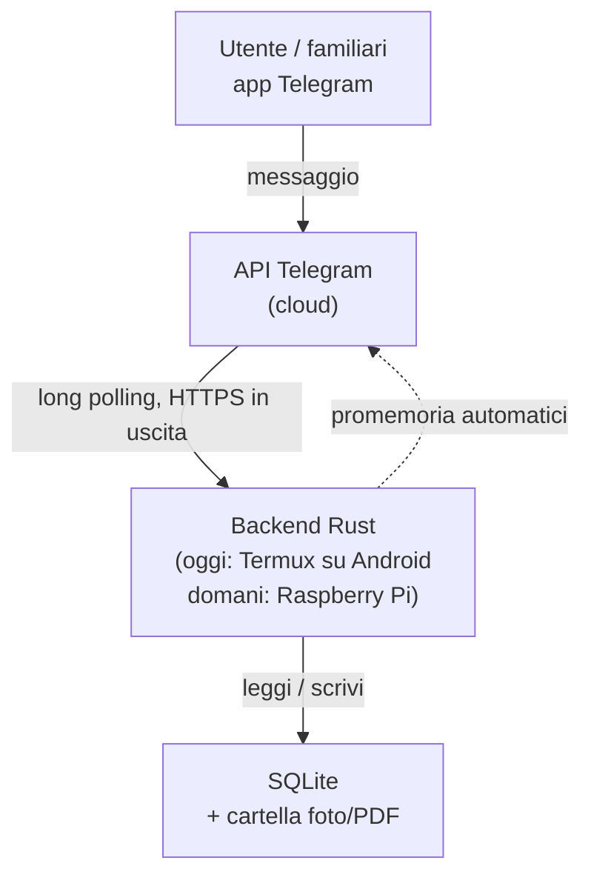

# Architettura

Questo documento descrive come è fatto il progetto e perché è stato fatto
così. L'obiettivo è che chiunque lo legga — anche senza aver seguito le
discussioni originali — capisca la struttura abbastanza da poterci mettere
mano.

## 1. Obiettivo del progetto

Un gestionale personale per tenere traccia delle cose di casa: vestiti,
veicoli, ricette e oggetti generici. L'interfaccia è un bot Telegram, così
chi lo usa (anche senza competenze informatiche) interagisce scrivendo
messaggi normali, e l'accesso da fuori casa è gratuito dal punto di vista
della rete: nessuna porta da aprire, nessun dominio da configurare.

## 2. Decisioni di design e perché

Queste sono le scelte fondamentali del progetto, con la motivazione. Se in
futuro si vuole cambiare una di queste decisioni, va aggiornata anche questa
sezione.

### 2.1 Telegram come unica interfaccia

**Scelta**: il bot Telegram è l'unico punto di accesso al sistema (nessuna
app dedicata, nessun sito web nella prima fase).

**Perché**: Telegram gestisce già autenticazione, cifratura del trasporto e
notifiche push. Il backend comunica con l'API di Telegram in **uscita**
(long polling), quindi non serve esporre nessuna porta sul router di casa.
Chi usa il bot non deve installare nulla oltre a Telegram, che già conosce.

### 2.2 Rust come linguaggio del backend

**Scelta**: tutto il backend è scritto in Rust.

**Perché**: niente garbage collector (consumi bassi, importante su hardware
limitato come un telefono o un Raspberry Pi), sicurezza di memoria a
compile-time (rilevante per un servizio esposto a internet), concorrenza
sicura per gestire più moduli in parallelo. È anche il linguaggio che lo
sviluppatore sta approfondendo, quindi il progetto serve anche da percorso
di apprendimento.

### 2.3 SQLite come database

**Scelta**: SQLite, non un database client-server come PostgreSQL.

**Perché**: SQLite è un singolo file sul disco, senza servizio separato da
installare e configurare. Questo è decisivo per la portabilità: il sistema
è pensato per partire su un telefono Android (via Termux) e poi migrare su
un Raspberry Pi. Copiare il database significa copiare un file. Su un
servizio con un solo utilizzatore principale (più eventuali familiari) le
prestazioni di SQLite non sono un collo di bottiglia. Se in futuro il
progetto crescesse molto, si potrebbe migrare a PostgreSQL senza cambiare
lo schema logico dei dati, solo il motore sotto.

### 2.4 Nessun container (Docker)

**Scelta**: il backend gira come binario Rust compilato nativamente, senza
Docker.

**Perché**: Docker non funziona su Termux/Android senza root, e l'hardware
di partenza è proprio un telefono Android. Anche una volta migrato su
Raspberry Pi, un solo servizio leggero non trae benefici significativi dalla
containerizzazione. Rust si presta bene alla compilazione nativa per target
diversi (`cargo build --target <target>`), quindi il "problema" che Docker
risolverebbe (portabilità tra ambienti diversi) è già gestito diversamente.

### 2.5 Hardware: si parte da uno smartphone Android (Termux), non da un Raspberry Pi

**Scelta**: la prima versione gira su un Samsung Galaxy S9 già posseduto,
tramite Termux, sempre collegato alla corrente. Un Raspberry Pi è previsto
come possibile passo successivo (anche con ruolo di NAS personale), ma non
è un prerequisito.

**Perché**: zero spesa iniziale, hardware già disponibile, batteria non
performante e microfono difettoso dello smartphone non contano nulla per un
dispositivo che resta sempre attaccato alla corrente e con lo schermo
spento. L'architettura è pensata apposta per rendere questo passaggio
indolore quando/se si deciderà di fare l'upgrade: basta copiare il database
e i file multimediali, ricompilare il binario per il nuovo target, e
configurare l'avvio automatico sul nuovo sistema.

Punti di attenzione specifici per Termux su Android (in particolare Samsung,
noto per una gestione aggressiva dei processi in background):

- Termux va installato da F-Droid o GitHub, non dal Play Store (versione
  obsoleta e non più aggiornata).
- `termux-wake-lock` evita che la CPU vada in sospensione mentre il bot è
  attivo.
- **Termux:Boot** (app separata) avvia lo script del bot al riavvio del
  telefono.
- L'ottimizzazione batteria per Termux va disattivata nelle impostazioni
  Android.

### 2.6 Tabella `items` centrale per foto, tag e promemoria

**Scelta**: ogni riga di ogni modulo (un vestito, un veicolo, una ricetta,
un oggetto) è anche una riga in una tabella `items` comune. Foto, tag e
promemoria fanno riferimento sempre a `items`, mai direttamente alle
tabelle dei singoli moduli.

**Perché**: senza questa tabella, foto/tag/promemoria andrebbero
implementati e interrogati separatamente per ciascuno dei quattro moduli.
Con `items` come punto comune, quella logica si scrive una volta sola.
Dettagli completi in `docs/schema-core.md`.


### 2.7 GitHub `main` come fonte ufficiale e ruoli dei dispositivi

**Scelta**: il branch `main` su GitHub è la fonte ufficiale del progetto. Il
PC Windows è il punto principale di sviluppo e gestione Git; il Galaxy S9 è
l'host reale e l'ambiente di test runtime.

**Perché**: separare i ruoli evita che ZIP, copie locali e modifiche parallele
creino stati divergenti. Il workflow normale è `PC -> GitHub -> S9`; una
modifica semplice nata sull'S9 può seguire temporaneamente
`S9 -> GitHub -> PC`, dopodiché si torna al flusso principale. Gli
aggiornamenti tra dispositivi usano preferibilmente `git pull --ff-only`, così
una divergenza non produce automaticamente merge inattesi.

Gli ZIP restano utili come snapshot o backup, ma non sostituiscono GitHub come
fonte di verità. Le procedure operative complete sono in `docs/HANDOFF.md`.

### 2.8 SQLite runtime e migration automatiche

**Scelta**: il backend usa SQLx 0.8.6 con driver SQLite bundled, runtime Tokio
e migration incorporate nel binario. `DATABASE_URL` puo' sovrascrivere il
percorso, ma il default e' `sqlite://data/db/gestionale.db`.

**Perche'**: SQLite resta adatto a un gestionale personale su un solo host,
mentre SQLx fornisce pool asincrono, gestione delle migration e una API Rust
chiara senza introdurre un server database separato. La serie 0.8 viene usata
intenzionalmente nello Step 4 per non imporre subito i requisiti toolchain piu'
nuovi della serie 0.9 sul Galaxy S9. Dependabot potra' proporre upgrade futuri
senza applicarli automaticamente.

All'avvio `src/db.rs`:

1. interpreta la URL SQLite;
2. crea la cartella padre se manca;
3. apre il database con `create_if_missing(true)`;
4. abilita esplicitamente le foreign key;
5. applica tutte le migration presenti in `migrations/`;
6. rende disponibile un `SqlitePool` al dispatcher Telegram.

Il file `build.rs` fa osservare a Cargo la cartella `migrations/`, cosi' nuove
migration vengono incorporate anche con Rust stable. Il comando `/status`
interroga lo stato reale del database senza modificare dati applicativi.

## 3. Flusso dei dati



Il backend non riceve mai connessioni in entrata: interroga periodicamente
i server Telegram (long polling) per nuovi messaggi. Questo è il motivo per
cui l'accesso da fuori rete locale funziona senza alcuna configurazione di
rete.

## 4. Struttura del repository

```text
gestionale-casa/
├── .github/
│   ├── workflows/
│   │   └── ci.yml             # CI Rust su push e pull request
│   └── dependabot.yml         # aggiornamenti dipendenze tramite PR
├── README.md                  # quick start e stato sintetico
├── CHANGELOG.md               # diario degli step e verifiche
├── ARCHITETTURA.md            # questo file
├── Cargo.toml
├── Cargo.lock                 # dependency graph bloccata e versionata
├── build.rs                    # ricompila se cambiano le migration
├── src/
│   ├── main.rs                # avvio del bot, dispatch dei comandi
│   ├── config.rs              # caricamento configurazione
│   ├── db.rs                  # pool SQLite, migration e stato runtime
│   ├── auth.rs                # whitelist chat_id autorizzati
│   └── modules/
│       ├── oggetti.rs
│       ├── vestiti.rs
│       ├── veicoli.rs
│       └── ricette.rs
├── migrations/                # una migration .sql per ogni modifica schema
├── scripts/
│   ├── termux-boot.sh         # avvio automatico su Android
│   └── backup.sh              # backup consistente tramite API SQLite
├── docs/
│   ├── HANDOFF.md             # consegna e workflow operativo
│   ├── schema-core.md
│   └── moduli/                # documentazione dei moduli funzionali
└── data/                      # database e file personali, NON su Git
```

**Perché file singoli per modulo invece di una cartella per modulo**: allo
stato attuale ogni modulo è abbastanza semplice da stare in un solo file.
Se un modulo crescesse molto (es. il modulo ricette con la logica di
aggregazione della spesa), verrà diviso in una sotto-cartella
(`modules/ricette/`) con più file interni — il resto della struttura non
cambia.

## 5. Sicurezza

- **Token del bot**: mai nel codice o nel repository, solo in `.env`
  (escluso da git tramite `.gitignore`).
- **Whitelist utenti**: il bot risponde solo ai `chat_id` presenti in
  `.env`; chiunque altro scriva al bot viene ignorato o rifiutato
  esplicitamente.
- **Nessuna porta in ascolto**: il backend non apre porte in entrata (vedi
  sezione 3), quindi non c'è superficie d'attacco di rete diretta.
- **Utente non privilegiato**: il servizio non gira come root/utente
  amministratore.
- **Aggiornamenti di sicurezza**: sistema operativo dell'host aggiornato
  regolarmente.
- **Accesso per manutenzione**: sulla LAN è operativo un normale server
  OpenSSH in Termux (porta 8022), usato dal PC per terminale e trasferimento
  patch via SCP. GitHub `main` resta la fonte ufficiale. L'accesso fuori LAN
  resta futuro e dovrà usare Tailscale + OpenSSH/Termux, senza esporre SSH
  tramite port forwarding pubblico.
- **Backup**: copia periodica di database e foto su storage esterno,
  verificata periodicamente (un backup mai testato non è un backup
  affidabile).

## 5.1 Interfaccia applicativa dei moduli

Dallo Step 5A l'interfaccia Telegram usa due ingressi paralleli:

1. **inline keyboard**, pensata per l'uso quotidiano e come interfaccia
   principale;
2. **comandi testuali equivalenti**, utili come scorciatoie e per test/debug.

Le due strade non duplicano la logica: convergono sulle stesse funzioni Rust e
sulle stesse operazioni SQL. Per esempio `➕ Nuovo oggetto` e
`/oggetto_nuovo` aprono lo stesso flusso.

Le bozze non ancora salvate sono mantenute solo in memoria per chat. I dati
persistenti vengono scritti esclusivamente quando l'utente conferma `✅ Salva`.
Il salvataggio dell'oggetto avviene in una singola transazione che crea prima
`items` e poi la riga specifica `oggetti`.

Per importi monetari il progetto usa **centesimi interi**, non valori `REAL`,
evitando errori di rappresentazione floating point.

## 5.2 Luoghi e multi-abitazione — requisito futuro

La posizione testuale di Step 5A è volutamente semplice e temporanea. Il sistema
dovrà in futuro trattare i luoghi come entità riconosciute, non come semplici
stringhe. I requisiti confermati sono:

- più abitazioni nello stesso gestionale;
- stanze appartenenti a una specifica abitazione;
- oggetti assegnabili e spostabili scegliendo un luogo registrato;
- elenchi filtrabili per abitazione e stanza;
- ricerca globale su tutte le abitazioni oppure limitata a un singolo ramo.

**Proposta architetturale da confermare prima di implementare:** una tabella
gerarchica `luoghi`, con `parent_id` e un tipo (almeno `casa` e `stanza`). La
struttura permetterebbe in seguito anche sotto-posizioni opzionali come armadio,
scaffale o box senza dover ridisegnare lo schema. Gli oggetti referenzierebbero
un `luogo_id`, mantenendo eventualmente un piccolo dettaglio libero per casi
come "scaffale 2".

Questa è una proposta, non una decisione definitiva: va approvata prima della
migration relativa.

## 6. Roadmap di sviluppo

Prima dei moduli funzionali viene completata e verificata l'infrastruttura
minima comune. Ogni modulo verrà poi documentato in dettaglio in
`docs/moduli/<nome>.md` prima di essere implementato.

- ~~**Step 1 — Scheletro iniziale**~~ — fatto.
- ~~**Step 2 — Schema dati core**~~ — fatto, vedi `docs/schema-core.md` e
  `migrations/20260812120000_schema_core.sql`.
- ~~**Step 3 — Base backend Telegram + whitelist**~~ — implementato e
  verificato sul Galaxy S9: test automatici, `/start`, `/ping` e whitelist
  end-to-end superati.
- ~~**Step 3.1 — Handoff, workflow Git e automazioni GitHub**~~ — chiuso e
  verificato con CI GitHub Actions verde (`fmt`, `check`, `test`, `clippy`).
- ~~**Step 4 — Connessione SQLite + migrazioni automatiche + `/status`**~~ —
  chiuso e verificato sul Galaxy S9: database creato realmente, migration
  applicata, `/status` operativo e secondo avvio sullo stesso DB superato.
- **Step 5 — Oggetti generici** — in sviluppo.
  - ~~**Step 5A**~~ — verifiche runtime completate sul Galaxy S9; si considera
    chiuso quando questa revisione è su `main` con CI verde. Include tabella
    `oggetti`, menu con inline keyboard e comandi equivalenti, creazione guidata,
    revisione sicura della bozza, elenco, ricerca e scheda singola.
  - **Step 5B** — foto degli oggetti usando la tabella core `foto`.
  - **Step 5C** — modifica ed eliminazione sicura degli oggetti già salvati.
  - **Step 5D** — documenti e tag.
  - **Step 5E** — garanzie e promemoria.
  - **Step 5F** — prestiti e storico.
- **Step 6 — Luoghi e multi-abitazione** — requisito futuro trasversale da
  progettare e confermare prima dell'implementazione: più case, stanze
  riconosciute, spostamento degli oggetti tra stanze, viste per casa/stanza e
  ricerca combinata su tutte le abitazioni.
- **Vestiti** — capi, materiali, taglie, stagionalità, outfit.
- **Veicoli** — anagrafica veicoli, scadenze manutenzione, storico interventi.
- **Ricette** — ricette con dosi scalabili, pianificazione pasti e aggregazione
  della lista della spesa.

La cronologia dettagliata di ogni step, incluse verifiche e differenze rispetto
allo stato precedente, è mantenuta in `CHANGELOG.md`. Il workflow operativo e
le istruzioni per la consegna sono in `docs/HANDOFF.md`.

## 7. Estensioni future (non nel perimetro attuale)

- **Arduino Uno**: possibile sensore ambientale (es. umidità armadio) o
  lettore di codici a barre per il modulo oggetti, collegabile via USB
  seriale al Raspberry Pi quando sarà in uso.
- **Raspberry Pi come NAS personale**: ruolo tenuto separato dal backend a
  livello logico, con storage dedicato (disco USB esterno).
- **Amministrazione remota del Galaxy S9**: step futuro separato basato, se i
  test lo confermeranno, su Tailscale + server OpenSSH di Termux con chiavi SSH
  e senza port forwarding pubblico. Deve includere test da reti differenti,
  gestione del riavvio e comportamento Android in background.


## Gestione file multimediali — Step 5B

Le foto non vengono affidate esclusivamente alla disponibilità futura dei file
Telegram. Il backend scarica una copia locale e il database conserva un percorso
relativo al progetto. Per gli oggetti la struttura scelta è:

```text
data/media/oggetti/<item_id>/telegram_<message_id>.<estensione>
```

La tabella core `foto` resta la fonte relazionale (`item_id`, `percorso_file`,
`ruolo`, `descrizione`). Non viene aggiunta una migration nello Step 5B perché lo
schema necessario era già stato predisposto nello Step 2. La prima immagine di un
item assume il ruolo `principale`; le successive `galleria`.

`data/` resta esclusa da Git. I file multimediali sono invece parte del backup
operativo: `scripts/backup.sh` copia `data/media` insieme al backup consistente
del database SQLite. Questa scelta rende il gestionale trasferibile in futuro su
un altro host senza dipendere dai file Telegram.

L'interfaccia Telegram mantiene la regola già adottata nello Step 5A: pulsanti
inline come percorso principale e comandi testuali equivalenti quando utili.
Inoltre il backend invia una notifica di avvio alle chat autorizzate e `/status`
fornisce sempre un pulsante per tornare al menu principale.
