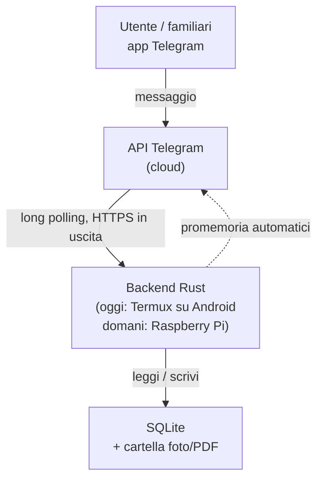

# Architettura

Questo documento descrive come è fatto il progetto e perché è stato fatto
così. L'obiettivo è che chiunque lo legga — anche senza aver seguito le
discussioni originali — capisca la struttura abbastanza da poterci mettere
mano.

## 1. Obiettivo del progetto

Un gestionale personale per tenere traccia delle cose di casa: vestiti,
veicoli, ricette e oggetti generici. L'interfaccia è un bot Telegram, così
chi lo usa (anche senza competenze informatiche) interagisce scrivendo
messaggi normali, e l'accesso da fuori casa è gratuito dal punto di vista
della rete: nessuna porta da aprire, nessun dominio da configurare.

## 2. Decisioni di design e perché

Queste sono le scelte fondamentali del progetto, con la motivazione. Se in
futuro si vuole cambiare una di queste decisioni, va aggiornata anche questa
sezione.

### 2.1 Telegram come unica interfaccia

**Scelta**: il bot Telegram è l'unico punto di accesso al sistema (nessuna
app dedicata, nessun sito web nella prima fase).

**Perché**: Telegram gestisce già autenticazione, cifratura del trasporto e
notifiche push. Il backend comunica con l'API di Telegram in **uscita**
(long polling), quindi non serve esporre nessuna porta sul router di casa.
Chi usa il bot non deve installare nulla oltre a Telegram, che già conosce.

### 2.2 Rust come linguaggio del backend

**Scelta**: tutto il backend è scritto in Rust.

**Perché**: niente garbage collector (consumi bassi, importante su hardware
limitato come un telefono o un Raspberry Pi), sicurezza di memoria a
compile-time (rilevante per un servizio esposto a internet), concorrenza
sicura per gestire più moduli in parallelo. È anche il linguaggio che lo
sviluppatore sta approfondendo, quindi il progetto serve anche da percorso
di apprendimento.

### 2.3 SQLite come database

**Scelta**: SQLite, non un database client-server come PostgreSQL.

**Perché**: SQLite è un singolo file sul disco, senza servizio separato da
installare e configurare. Questo è decisivo per la portabilità: il sistema
è pensato per partire su un telefono Android (via Termux) e poi migrare su
un Raspberry Pi. Copiare il database significa copiare un file. Su un
servizio con un solo utilizzatore principale (più eventuali familiari) le
prestazioni di SQLite non sono un collo di bottiglia. Se in futuro il
progetto crescesse molto, si potrebbe migrare a PostgreSQL senza cambiare
lo schema logico dei dati, solo il motore sotto.

### 2.4 Nessun container (Docker)

**Scelta**: il backend gira come binario Rust compilato nativamente, senza
Docker.

**Perché**: Docker non funziona su Termux/Android senza root, e l'hardware
di partenza è proprio un telefono Android. Anche una volta migrato su
Raspberry Pi, un solo servizio leggero non trae benefici significativi dalla
containerizzazione. Rust si presta bene alla compilazione nativa per target
diversi (`cargo build --target <target>`), quindi il "problema" che Docker
risolverebbe (portabilità tra ambienti diversi) è già gestito diversamente.

### 2.5 Hardware: si parte da uno smartphone Android (Termux), non da un Raspberry Pi

**Scelta**: la prima versione gira su un Samsung Galaxy S9 già posseduto,
tramite Termux, sempre collegato alla corrente. Un Raspberry Pi è previsto
come possibile passo successivo (anche con ruolo di NAS personale), ma non
è un prerequisito.

**Perché**: zero spesa iniziale, hardware già disponibile, batteria non
performante e microfono difettoso dello smartphone non contano nulla per un
dispositivo che resta sempre attaccato alla corrente e con lo schermo
spento. L'architettura è pensata apposta per rendere questo passaggio
indolore quando/se si deciderà di fare l'upgrade: basta copiare il database
e i file multimediali, ricompilare il binario per il nuovo target, e
configurare l'avvio automatico sul nuovo sistema.

Punti di attenzione specifici per Termux su Android (in particolare Samsung,
noto per una gestione aggressiva dei processi in background):

- Termux va installato da F-Droid o GitHub, non dal Play Store (versione
  obsoleta e non più aggiornata).
- `termux-wake-lock` evita che la CPU vada in sospensione mentre il bot è
  attivo.
- **Termux:Boot** (app separata) avvia lo script del bot al riavvio del
  telefono.
- L'ottimizzazione batteria per Termux va disattivata nelle impostazioni
  Android.

### 2.6 Tabella `items` centrale per foto, tag e promemoria

**Scelta**: ogni riga di ogni modulo (un vestito, un veicolo, una ricetta,
un oggetto) è anche una riga in una tabella `items` comune. Foto, tag e
promemoria fanno riferimento sempre a `items`, mai direttamente alle
tabelle dei singoli moduli.

**Perché**: senza questa tabella, foto/tag/promemoria andrebbero
implementati e interrogati separatamente per ciascuno dei quattro moduli.
Con `items` come punto comune, quella logica si scrive una volta sola.
Dettagli completi in `docs/schema-core.md`.

## 3. Flusso dei dati



Il backend non riceve mai connessioni in entrata: interroga periodicamente
i server Telegram (long polling) per nuovi messaggi. Questo è il motivo per
cui l'accesso da fuori rete locale funziona senza alcuna configurazione di
rete.

## 4. Struttura del repository

```
gestionale-casa/
├── README.md            # quick start, comandi di installazione
├── ARCHITETTURA.md       # questo file
├── Cargo.toml
├── src/
│   ├── main.rs             # avvio del bot, dispatch dei comandi
│   ├── config.rs           # caricamento di .env (token, whitelist utenti)
│   ├── db.rs                # connessione SQLite e migrazioni
│   ├── auth.rs               # whitelist chat_id autorizzati
│   └── modules/                # logica specifica di ciascun modulo
│       ├── oggetti.rs
│       ├── vestiti.rs
│       ├── veicoli.rs
│       └── ricette.rs
├── migrations/            # file .sql, uno per ogni modifica allo schema
├── scripts/
│   ├── termux-boot.sh       # avvio automatico su Android
│   └── backup.sh              # backup periodico di database e foto
├── docs/moduli/              # un file .md per ciascun modulo, con lo
│                               schema dati e le regole specifiche
└── data/                       # database SQLite e foto (NON su git)
```

**Perché file singoli per modulo invece di una cartella per modulo**: allo
stato attuale ogni modulo è abbastanza semplice da stare in un solo file.
Se un modulo crescesse molto (es. il modulo ricette con la logica di
aggregazione della spesa), verrà diviso in una sotto-cartella
(`modules/ricette/`) con più file interni — il resto della struttura non
cambia.

## 5. Sicurezza

- **Token del bot**: mai nel codice o nel repository, solo in `.env`
  (escluso da git tramite `.gitignore`).
- **Whitelist utenti**: il bot risponde solo ai `chat_id` presenti in
  `.env`; chiunque altro scriva al bot viene ignorato o rifiutato
  esplicitamente.
- **Nessuna porta in ascolto**: il backend non apre porte in entrata (vedi
  sezione 3), quindi non c'è superficie d'attacco di rete diretta.
- **Utente non privilegiato**: il servizio non gira come root/utente
  amministratore.
- **Aggiornamenti di sicurezza**: sistema operativo dell'host aggiornato
  regolarmente.
- **Accesso remoto per manutenzione** (SSH o simili): se necessario, tramite
  una VPN leggera (es. Tailscale) invece di esporre porte direttamente.
- **Backup**: copia periodica di database e foto su storage esterno,
  verificata periodicamente (un backup mai testato non è un backup
  affidabile).

## 6. Roadmap di sviluppo

Prima dei moduli funzionali viene completata e verificata l'infrastruttura
minima comune. Ogni modulo verrà poi documentato in dettaglio in
`docs/moduli/<nome>.md` prima di essere implementato, con schema dati,
comandi del bot previsti e casi d'uso.

1. ~~**Scheletro iniziale**~~ — fatto.
2. ~~**Schema dati core**~~ — fatto, vedi `docs/schema-core.md` e
   `migrations/20260812120000_schema_core.sql`.
3. ~~**Base backend Telegram + whitelist**~~ — implementato e verificato sul
   Galaxy S9: test automatici superati, `/start` e `/ping` operativi, whitelist
   verificata anche da un secondo account non autorizzato.
4. **Connessione SQLite + migrazioni automatiche** — prossimo step.
5. **Oggetti generici** — catalogo libero, base concettuale anche per gli
   altri moduli.
6. **Vestiti** — capi, materiali, taglie, stagionalità, outfit.
7. **Veicoli** — anagrafica veicoli, scadenze manutenzione, storico
   interventi.
8. **Ricette** — ricette con dosi scalabili, pianificazione pasti e
   aggregazione della lista della spesa.

La cronologia dettagliata di ogni step, incluse verifiche e differenze
rispetto allo stato precedente, è mantenuta in `CHANGELOG.md`.

## 7. Estensioni future (non nel perimetro attuale)

- **Arduino Uno**: possibile sensore ambientale (es. umidità armadio) o
  lettore di codici a barre per il modulo oggetti, collegabile via USB
  seriale al Raspberry Pi quando sarà in uso.
- **Raspberry Pi come NAS personale**: ruolo tenuto separato dal backend a
  livello logico, con storage dedicato (disco USB esterno).
