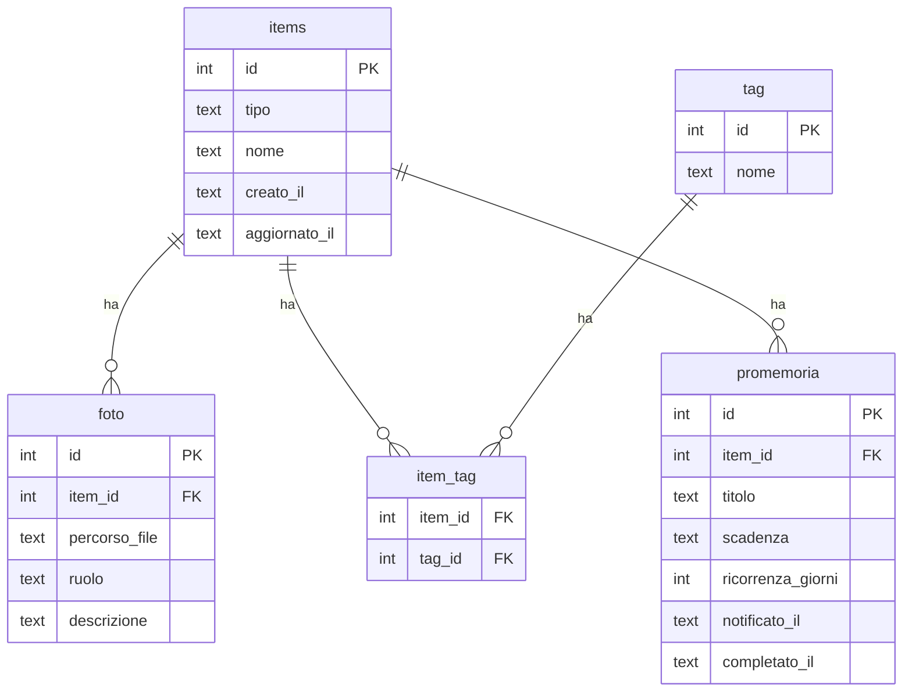

# Schema dati e migration

Le due cose stanno insieme perche' nel progetto sono legate da una regola sola:
**una migration applicata al database reale non si tocca piu'**.

## La regola delle migration

Il riferimento operativo non e' il repository: e' il database che gira
sull'S9. Riscrivere una migration gia' registrata in `_sqlx_migrations`
renderebbe codice e dati incoerenti in un modo che nessun controllo
rileverebbe. Ogni correzione e' quindi una **nuova migration append-only**,
anche quando corregge un errore di poche ore prima.

Ne discende che alcune colonne restano nello schema senza essere piu' la fonte
della verita': sono elencate in `docs/storico-del-progetto.md`.

Prima di applicare una migration al database reale — lo fa
`scripts/aggiorna-s9.sh`, non serve farlo a mano:

1. backup con `sqlite3 .backup`, che e' coerente anche a bot acceso;
2. controllo che la versione non sia gia' in `_sqlx_migrations`;
3. prova su una **copia** del database;
4. `PRAGMA integrity_check` e `PRAGMA foreign_key_check` sulla copia;
5. solo allora l'avvio, che applica al database vero.

Il conteggio delle migration e quali sono applicate stanno in `STATO.md`.
L'elenco file per file e' in `migrations/README.md`, accanto ai file stessi.

## Tabelle mai usate

Esistono nello schema ma **nessuna riga di codice le legge o le scrive**:
`item_condivisioni`, `tag`, `item_tag`, `promemoria`. Sono schema morto, nato
da progetti poi cambiati. Prima di riusarne una va verificato che il modello
sia ancora quello giusto, invece di darlo per buono perche' la tabella c'e'.

Attenzione anche a `items.tipo`, che ammette il valore `'ricetta'`: le ricette
hanno invece una tabella propria e non passano da `items`.

---

Le tabelle descritte qui sono condivise dai moduli basati su `items` (oggetti,
vestiti, veicoli, ricette). Definite una sola volta, evitano di
reimplementare quattro volte la stessa logica per foto, tag e promemoria.

Dallo Step 6A esiste anche una **estensione condivisa** per la posizione fisica:
`abitazioni`, `stanze` e `item_luogo`, definita in una migration successiva e
documentata in `docs/moduli/luoghi.md`. Non viene retroattivamente aggiunta alla
migration core, che resta immutabile.

Migrazione corrispondente: `migrations/20260812120000_schema_core.sql`.

## Perché una tabella `items` centrale

Ogni modulo ha bisogno delle stesse tre cose: allegare foto, assegnare
tag/categorie, impostare promemoria/scadenze. Due strade possibili:

1. **Tabelle separate per modulo** (`vestiti_foto`, `veicoli_foto`,
   `ricette_foto`, `oggetti_foto`, e così via per tag e promemoria):
   niente tabella generica, ma la stessa logica va scritta e interrogata
   quattro volte, una per modulo.
2. **Tabella `items` centrale**: ogni riga di ogni modulo (un vestito, un
   veicolo, una ricetta, un oggetto) è *anche* una riga in `items`. Foto,
   tag e promemoria puntano sempre a `items`, indipendentemente dal
   modulo. La logica per allegare una foto o impostare un promemoria si
   scrive una volta sola e funziona per tutti i moduli.

Si è scelta la seconda strada: per un progetto sviluppato e mantenuto da
una persona sola, evitare la quadruplicazione di codice pesa più della
leggera complessità aggiuntiva (ogni modulo deve creare prima la riga in
`items`, poi la propria riga specifica con lo stesso `id`).

## Diagramma

La tabella specifica `oggetti` esiste dallo Step 5A e usa lo stesso ID della
riga `items`. Vestiti, Veicoli e Ricette seguiranno lo stesso principio quando
verranno implementati, salvo una decisione architetturale esplicitamente
documentata.

## Tabelle

### `items`
La riga "anagrafica" di ogni cosa gestita dal sistema, di qualunque
modulo.

| Campo | Tipo | Note |
|---|---|---|
| `id` | INTEGER | chiave primaria, generata automaticamente |
| `tipo` | TEXT | uno tra `oggetto`, `vestito`, `veicolo`, `ricetta` |
| `nome` | TEXT | nome visualizzato, usato ad esempio nei messaggi di promemoria senza dover interrogare la tabella specifica del modulo |
| `creato_il` / `aggiornato_il` | TEXT | timestamp ISO8601 |

### `foto`
Foto o documenti (es. libretto veicolo, scontrino) allegati a un item.

| Campo | Tipo | Note |
|---|---|---|
| `item_id` | INTEGER | riferimento a `items(id)` |
| `percorso_file` | TEXT | percorso del file dentro `data/media/` |
| `ruolo` | TEXT | opzionale, es. `principale`, `libretto`, `scontrino` — libero e non vincolato, per restare flessibile tra moduli diversi |
| `descrizione` | TEXT | didascalia libera |

### `tag` e `item_tag`
Sistema di categorie/etichette libero e condiviso tra tutti i moduli (es.
`estate`, `formale`, `da_revisionare`). `tag` contiene i nomi unici,
`item_tag` è la tabella di associazione molti-a-molti con `items`.

### `promemoria`
Scadenze e promemoria futuri legati a un item (es. "cambio olio" per un
veicolo, "controlla garanzia" per un oggetto).

| Campo | Tipo | Note |
|---|---|---|
| `scadenza` | TEXT | data (ISO8601) in cui il promemoria deve scattare |
| `ricorrenza_giorni` | INTEGER | opzionale: se presente, alla conferma del promemoria se ne crea uno nuovo a `scadenza + ricorrenza_giorni` giorni (es. 180 per un controllo semestrale) |
| `notificato_il` | TEXT | valorizzato quando il bot ha effettivamente inviato la notifica, evita invii duplicati |
| `completato_il` | TEXT | valorizzato quando l'utente conferma di aver fatto quanto richiesto |

Il meccanismo che controlla periodicamente `promemoria` e invia i messaggi
via bot (lo *scheduler*) verrà progettato insieme al primo modulo che lo
usa concretamente (i veicoli, con le scadenze di manutenzione).

## Estensione condivisa Step 6A: `item_luogo`

La posizione strutturata non viene duplicata nelle tabelle specifiche dei
moduli. `item_luogo.item_id` punta a `items(id)` e collega l'elemento a una
`abitazione` e, opzionalmente, a una `stanza`.

Questo mantiene lo stesso principio dello schema core: la funzione trasversale
si implementa una volta sola. Il vecchio campo `oggetti.posizione` resta invece
un dettaglio libero specifico del modulo.

Vedi `docs/moduli/luoghi.md` e
`migrations/20260815183000_luoghi.sql`.

## Step 7.4: Lista della spesa

Questo documento e' rimasto allo schema degli Step 5-6: le tabelle di
Alimentazione e del planner (Step 7.2-7.3) sono documentate nei rispettivi
`docs/moduli/*.md` invece che qui. Le due tabelle qui sotto sono le uniche
nuove dell'8 settembre 2026 (`migrations/20260908150000_lista_spesa.sql`);
per il resto dello schema di Alimentazione/Planner vedi
`docs/moduli/planner.md` e `docs/moduli/lista-spesa.md`.

### `liste_spesa`
Una sola lista attiva per spazio condiviso, e una per utente senza spazio
(stesso principio di `planner_alimentari`, indici unique parziali su
`spazio_id`). Ha un proprio intervallo di date, indipendente dalle
settimane del planner.

| Campo | Tipo | Note |
|---|---|---|
| `proprietario_utente_id` | INTEGER | riferimento a `utenti(id)` |
| `spazio_id` | INTEGER | nullable: `NULL` per una lista personale |
| `data_inizio` / `data_fine` | TEXT | intervallo su cui si aggregano i pasti pianificati |
| `aggiornata_il` | TEXT | ultima volta che è girato un refresh esplicito, `NULL` se mai |

### `liste_spesa_voci`
Le voci della lista: generate dall'aggregazione dei pasti pianificati, o
manuali (testo libero, per un prodotto commerciale non modellato).

| Campo | Tipo | Note |
|---|---|---|
| `lista_id` | INTEGER | riferimento a `liste_spesa(id)` |
| `origine` | TEXT | `generato` o `manuale` |
| `alimento_id` | INTEGER | nullable, riferimento a `alimenti(id)` |
| `prodotto_alimentare_id` | INTEGER | nullable, riferimento a `prodotti_alimentari(id)` (9 settembre 2026, aggiunte dal catalogo su un prodotto specifico) |
| `descrizione` | TEXT | nome alimento/prodotto (generato) o testo libero (manuale) |
| `quantita` / `unita_simbolo` | REAL / TEXT | nullable solo per `origine = 'manuale'` |
| `comprato` | INTEGER | flag per riga intera, non quantità parziale |
| `comprato_il` | TEXT | valorizzato quando `comprato = 1` |
| `ordinamento` | INTEGER | posizione nella lista (9 settembre 2026); indipendente da `comprato`, si sposta solo con "↕️ Riordina lista" |

Una volta `comprato = 1` un trigger a database (`trg_lista_spesa_voce_comprata_immutabile`)
impedisce di modificare gli altri campi (inclusa `prodotto_alimentare_id`,
esclusi `comprato` e `ordinamento`) — solo il toggle di `comprato` stesso
resta permesso dal codice applicativo, stesso principio del congelamento di
`planner_pasti`. Il refresh esplicito (`🔄 Aggiorna lista`) tocca solo le
voci `origine = 'generato' AND comprato = 0`: le cancella e re-inserisce da
zero il risultato fresco dell'aggregazione (planner più aggiunte dal
catalogo, vedi sotto), senza mai toccare una voce comprata o una voce
manuale.

**Fusione delle voci comprate frammentate (9 settembre 2026)**: spuntare
una voce già comprata più di una volta per lo stesso alimento (dopo che un
pasto aggiunto in seguito ha creato una riga residua per la differenza,
vedi `sottrai_gia_comprato`) fonderebbe due righe comprate distinte per
sempre, senza intervento. `fondi_comprate_se_serve` lo evita: passa la
voce appena spuntata da `comprato = 0` a `1` due volte, con
l'aggiornamento della quantità in mezzo (l'unico modo per cambiare
`quantita` mentre l'altra riga resta `comprato = 1`, dato il trigger sopra)
dentro un'unica transazione, poi elimina la riga fusa. Lo stesso principio
vale al contrario quando si deseleziona una voce: `aggiorna_lista` gira di
nuovo da solo (vedi `docs/moduli/lista-spesa.md`).

### `liste_spesa_aggiunte_catalogo` (9 settembre 2026)
Aggiunte dal catalogo per "➕ Aggiungi voce manuale → 🔎 Cerca nel
catalogo": a differenza delle righe `generato` di `liste_spesa_voci`, non
sono uno snapshot — restano qui e partecipano di nuovo ogni volta al
ricalcolo di `aggiorna_lista`, finché non vengono coperte da una voce
comprata. Dettagli e motivazione della scelta di design in
`docs/moduli/lista-spesa.md`, sezione "Aggiunta dal catalogo".

| Campo | Tipo | Note |
|---|---|---|
| `lista_id` | INTEGER | riferimento a `liste_spesa(id)`, `ON DELETE CASCADE` |
| `tipo` | TEXT | `alimento` (si somma al fabbisogno del planner) o `prodotto` (riga sempre separata) |
| `alimento_id` | INTEGER | nullable, riferimento a `alimenti(id)`, valorizzato solo per `tipo = 'alimento'` |
| `prodotto_alimentare_id` | INTEGER | nullable, riferimento a `prodotti_alimentari(id)`, valorizzato solo per `tipo = 'prodotto'` |
| `descrizione_snapshot` | TEXT | nome al momento dell'aggiunta, resta leggibile anche se l'alimento/prodotto viene poi cancellato dal catalogo |
| `quantita` / `unita_simbolo` | REAL / TEXT | sempre obbligatorie (a differenza delle voci manuali libere, qui la quantità serve a sommare) |

Nessun CHECK che leghi `tipo` alla colonna non-NULL corrispondente:
`alimento_id`/`prodotto_alimentare_id` sono `ON DELETE SET NULL`, e
quell'`UPDATE` violerebbe un CHECK del genere quando la riga referenziata
viene cancellata — stesso motivo per cui
`planner_pasto_ingredienti_snapshot.alimento_id` non ha un vincolo simile.

## Step 7.4bis: Turni e routine (prima fetta, 10 settembre 2026)

Nuove tabelle di `migrations/20260910120000_turni_e_routine.sql`, dominio e
scelte di design in `docs/moduli/turni-e-routine.md`.

### `turno_modelli`
Un modello (es. "Chiusura") descrive una giornata tipo con i suoi pasti di
default. Stessa forma di visibilità di `planner_alimentari`/`liste_spesa`:
appartiene allo spazio predefinito dell'attore che lo crea.

| Campo | Tipo | Note |
|---|---|---|
| `proprietario_utente_id` | INTEGER | riferimento a `utenti(id)` |
| `spazio_id` | INTEGER | nullable nello schema, in pratica sempre valorizzato con lo spazio predefinito dell'attore |
| `nome` / `nome_normalizzato` | TEXT | nome scelto dall'utente |
| `archiviato` | INTEGER | un modello archiviato non è più selezionabile, ma le assegnazioni già fatte restano (snapshot) |

### `turno_modello_pasti`
I pasti di default di un modello.

| Campo | Tipo | Note |
|---|---|---|
| `modello_id` | INTEGER | riferimento a `turno_modelli(id)`, `ON DELETE CASCADE` |
| `tipo_pasto` | TEXT | stesso vocabolario di `planner_pasti.tipo_pasto` |
| `orario` | TEXT | opzionale, `HH:MM` |
| `situazione` | TEXT | `casa` / `lavoro` / `fuori` / `saltato` / `altro` |
| `preparazione_anticipata` | INTEGER | booleano |
| `preparazione_note` | TEXT | opzionale, ammessa solo se `preparazione_anticipata = 1` (CHECK) |
| `nota` | TEXT | libera, opzionale |
| `ordinamento` | INTEGER | ordine di visualizzazione, in coda a ogni aggiunta |

### `turno_assegnazioni`
Un modello assegnato a una data per un profilo alimentare. **Copia** i
pasti del modello al momento dell'assegnazione (mai un riferimento vivo):
il nome del modello è congelato in `modello_nome_snapshot`, così
rinominare/archiviare/cancellare il modello dopo non cambia le
assegnazioni già fatte.

| Campo | Tipo | Note |
|---|---|---|
| `modello_id` | INTEGER | nullable, `ON DELETE SET NULL` — l'assegnazione sopravvive alla cancellazione del modello |
| `modello_nome_snapshot` | TEXT | nome del modello al momento dell'assegnazione |
| `profilo_alimentare_id` | INTEGER | nullable, `ON DELETE SET NULL`, riferimento a `profili_alimentari(id)` |
| `profilo_nome_snapshot` | TEXT | nome del profilo al momento dell'assegnazione |
| `data` | TEXT | la data assegnata |

Indice unico parziale su `(profilo_alimentare_id, data)` quando il profilo
non è nullo: un solo turno assegnato per profilo e giorno. Assegnare di
nuovo sullo stesso profilo/giorno richiede una sostituzione esplicita
lato applicativo (l'utente conferma, poi la vecchia assegnazione viene
eliminata e ricreata) — non una fusione.

### `turno_assegnazione_pasti`
I pasti copiati per una singola assegnazione: stessi campi di
`turno_modello_pasti` (tranne `modello_id`, sostituito da
`assegnazione_id`). Modificare o rimuovere una riga qui non tocca mai
`turno_modello_pasti`.

## Cosa NON è in questo schema

Ogni modulo avrà anche proprie tabelle non condivise: per esempio il
modulo vestiti avrà una tabella `outfit` (che aggrega più vestiti), il
modulo veicoli avrà uno `storico_interventi` (interventi già effettuati,
diverso dai promemoria futuri), il modulo ricette avrà `ingredienti` e
`pianificazione_pasti`. Verranno progettate una alla volta, con un file
dedicato in `docs/moduli/`.
