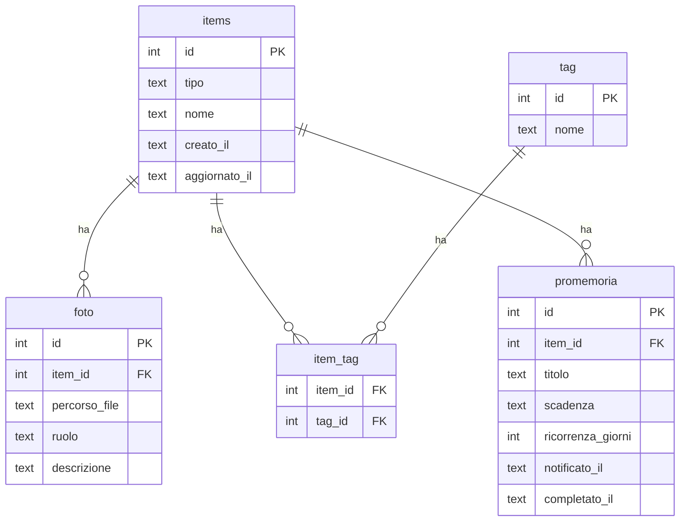

# Schema dati core

Le tabelle descritte qui sono condivise dai moduli basati su `items` (oggetti,
vestiti, veicoli, ricette). Definite una sola volta, evitano di
reimplementare quattro volte la stessa logica per foto, tag e promemoria.

Dallo Step 6A esiste anche una **estensione condivisa** per la posizione fisica:
`abitazioni`, `stanze` e `item_luogo`, definita in una migration successiva e
documentata in `docs/moduli/luoghi.md`. Non viene retroattivamente aggiunta alla
migration core, che resta immutabile.

Migrazione corrispondente: `migrations/20260812120000_schema_core.sql`.

## Perché una tabella `items` centrale

Ogni modulo ha bisogno delle stesse tre cose: allegare foto, assegnare
tag/categorie, impostare promemoria/scadenze. Due strade possibili:

1. **Tabelle separate per modulo** (`vestiti_foto`, `veicoli_foto`,
   `ricette_foto`, `oggetti_foto`, e così via per tag e promemoria):
   niente tabella generica, ma la stessa logica va scritta e interrogata
   quattro volte, una per modulo.
2. **Tabella `items` centrale**: ogni riga di ogni modulo (un vestito, un
   veicolo, una ricetta, un oggetto) è *anche* una riga in `items`. Foto,
   tag e promemoria puntano sempre a `items`, indipendentemente dal
   modulo. La logica per allegare una foto o impostare un promemoria si
   scrive una volta sola e funziona per tutti i moduli.

Si è scelta la seconda strada: per un progetto sviluppato e mantenuto da
una persona sola, evitare la quadruplicazione di codice pesa più della
leggera complessità aggiuntiva (ogni modulo deve creare prima la riga in
`items`, poi la propria riga specifica con lo stesso `id`).

## Diagramma

La tabella specifica `oggetti` esiste dallo Step 5A e usa lo stesso ID della
riga `items`. Vestiti, Veicoli e Ricette seguiranno lo stesso principio quando
verranno implementati, salvo una decisione architetturale esplicitamente
documentata.

## Tabelle

### `items`
La riga "anagrafica" di ogni cosa gestita dal sistema, di qualunque
modulo.

| Campo | Tipo | Note |
|---|---|---|
| `id` | INTEGER | chiave primaria, generata automaticamente |
| `tipo` | TEXT | uno tra `oggetto`, `vestito`, `veicolo`, `ricetta` |
| `nome` | TEXT | nome visualizzato, usato ad esempio nei messaggi di promemoria senza dover interrogare la tabella specifica del modulo |
| `creato_il` / `aggiornato_il` | TEXT | timestamp ISO8601 |

### `foto`
Foto o documenti (es. libretto veicolo, scontrino) allegati a un item.

| Campo | Tipo | Note |
|---|---|---|
| `item_id` | INTEGER | riferimento a `items(id)` |
| `percorso_file` | TEXT | percorso del file dentro `data/media/` |
| `ruolo` | TEXT | opzionale, es. `principale`, `libretto`, `scontrino` — libero e non vincolato, per restare flessibile tra moduli diversi |
| `descrizione` | TEXT | didascalia libera |

### `tag` e `item_tag`
Sistema di categorie/etichette libero e condiviso tra tutti i moduli (es.
`estate`, `formale`, `da_revisionare`). `tag` contiene i nomi unici,
`item_tag` è la tabella di associazione molti-a-molti con `items`.

### `promemoria`
Scadenze e promemoria futuri legati a un item (es. "cambio olio" per un
veicolo, "controlla garanzia" per un oggetto).

| Campo | Tipo | Note |
|---|---|---|
| `scadenza` | TEXT | data (ISO8601) in cui il promemoria deve scattare |
| `ricorrenza_giorni` | INTEGER | opzionale: se presente, alla conferma del promemoria se ne crea uno nuovo a `scadenza + ricorrenza_giorni` giorni (es. 180 per un controllo semestrale) |
| `notificato_il` | TEXT | valorizzato quando il bot ha effettivamente inviato la notifica, evita invii duplicati |
| `completato_il` | TEXT | valorizzato quando l'utente conferma di aver fatto quanto richiesto |

Il meccanismo che controlla periodicamente `promemoria` e invia i messaggi
via bot (lo *scheduler*) verrà progettato insieme al primo modulo che lo
usa concretamente (i veicoli, con le scadenze di manutenzione).

## Estensione condivisa Step 6A: `item_luogo`

La posizione strutturata non viene duplicata nelle tabelle specifiche dei
moduli. `item_luogo.item_id` punta a `items(id)` e collega l'elemento a una
`abitazione` e, opzionalmente, a una `stanza`.

Questo mantiene lo stesso principio dello schema core: la funzione trasversale
si implementa una volta sola. Il vecchio campo `oggetti.posizione` resta invece
un dettaglio libero specifico del modulo.

Vedi `docs/moduli/luoghi.md` e
`migrations/20260815183000_luoghi.sql`.

## Cosa NON è in questo schema

Ogni modulo avrà anche proprie tabelle non condivise: per esempio il
modulo vestiti avrà una tabella `outfit` (che aggrega più vestiti), il
modulo veicoli avrà uno `storico_interventi` (interventi già effettuati,
diverso dai promemoria futuri), il modulo ricette avrà `ingredienti` e
`pianificazione_pasti`. Verranno progettate una alla volta, con un file
dedicato in `docs/moduli/`.
